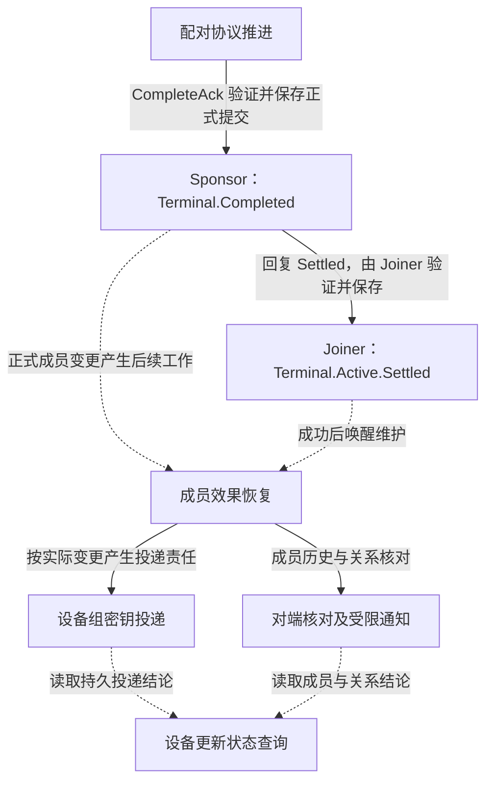
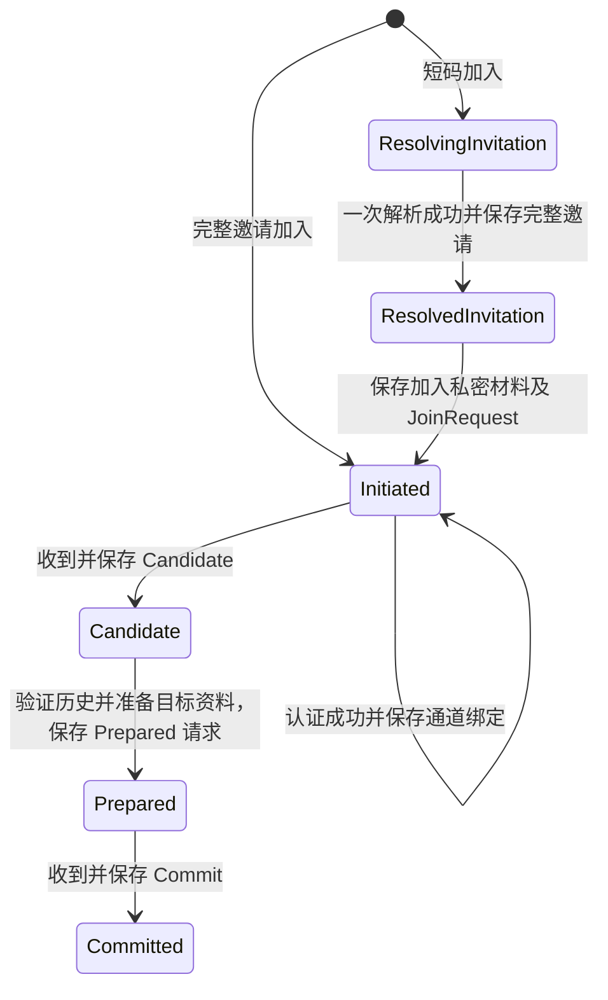
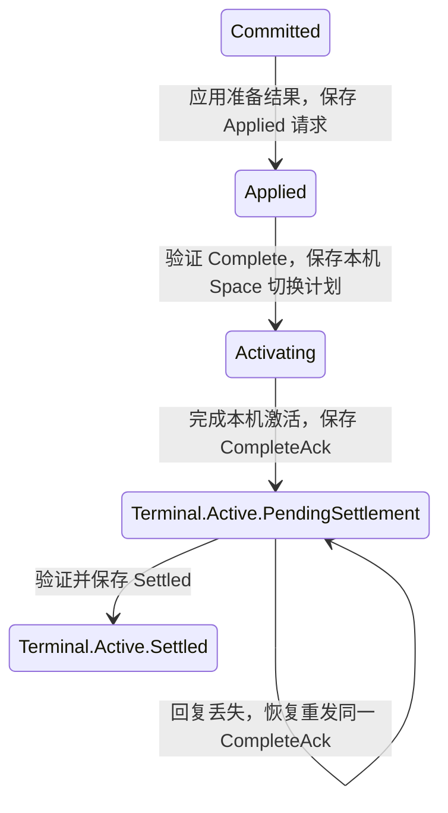
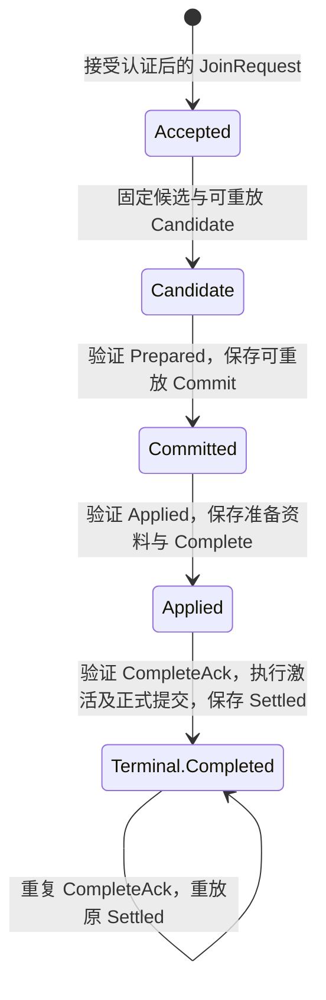
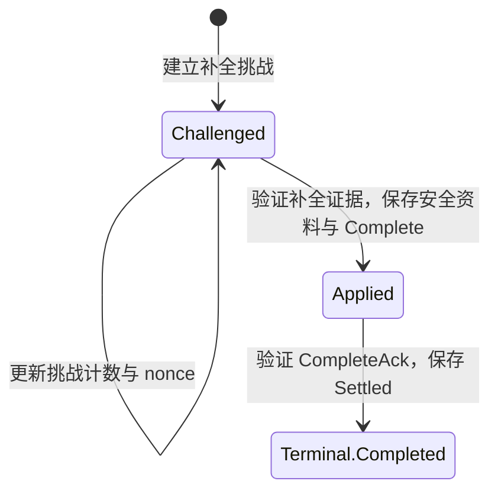
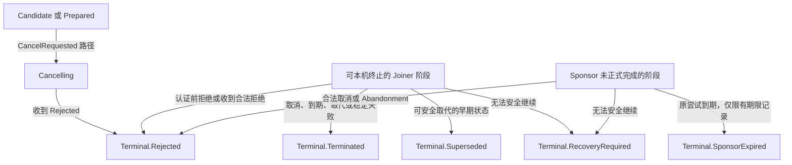
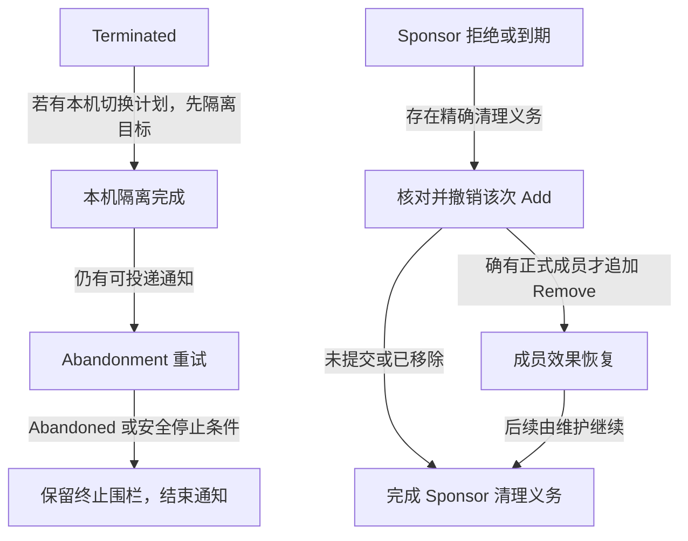
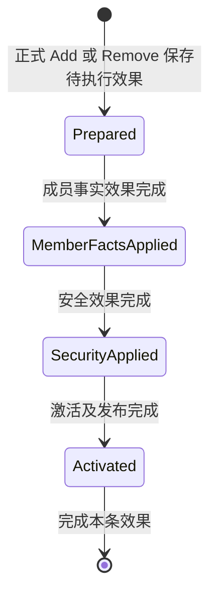
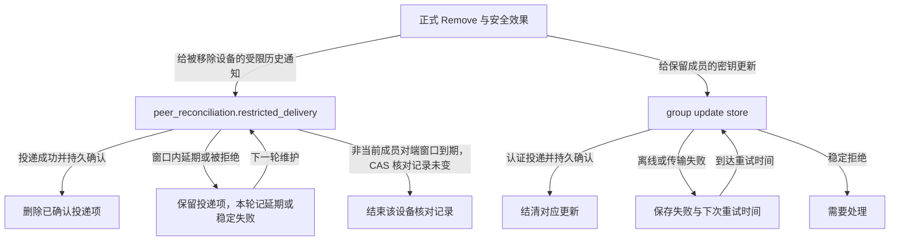

# 配对生命周期与终态收尾

本文描述当前实现中一次配对的协议状态，以及协议记录之外仍需推进的工作。图按双方、异常出口和收尾责任拆分；
节点使用源码状态名，箭头说明触发条件。它不是新状态机设计，也不表示已经存在覆盖所有收尾工作的统一完成判定。

配对协议的完整负责人是 Application 的 `SpaceAdmissionProtocol`，内部由 Joiner、Sponsor、Recovery 分工。
Core 只产生新记录与副作用清单；Application 执行能力并保存推进结果。成员历史及其效果、关系核对和设备组密钥投递
各有持久状态，统一维护流程负责触发它们，但这些状态没有合并成一条配对记录。

## 先分清三个完成边界

- `Complete` 不是 `Settled`，`Sponsor::Applied` 不是正式成员提交完成。
- `Terminal::Active::PendingSettlement` 虽在 Core 的 Terminal 分类中，仍需发送 `CompleteAck`、取得 `Settled`。
- 双端协议完成不等于所有其他设备已确认变更。图中虚线表示跨负责人唤醒或状态读取，不是同一事务或同一状态机转换。
- 查询得到的 `SpaceDeviceUpdateStatus` 是当前 Space 的汇总，可能包含其他成员操作，不能反向解释为某次配对的全局完成证明。

## Joiner：建立候选

`ResolvingInvitation` 内部先从 `Ready` 保存为 `Started`，再执行一次短码解析。`Started` 中断后不能重用短码；
失败进入本机拒绝，需新邀请。完整邀请无需经过短码状态。认证前后都叫 `Initiated`，以内部通道状态区分。
这里的 `Committed` 表示已保存协议 Commit，不可据名称推断邀请方已经正式添加成员。

## Joiner：应用、激活与最终确认

本机切换计划由既有激活能力执行并恢复，不能用 UI 已显示目标 Space 代替最终确认。
后续成员效果或密钥投递失败不把 `Settled` 改回准备状态，应由对应持久收尾责任恢复。

## Sponsor：候选到正式提交

正式成员提交边界在最终确认处理，不在 `Prepared` 或 `Applied`。同一消息重放读取保存的原回复，不创建第二次成员加入。
以上箭头是业务推进概览，不把激活能力调用、记录提交和后续维护画成一个未经证明的跨存储原子事务。

### CompletionHelper：独立恢复角色

Helper 是另一类记录角色，不是 Sponsor 正常路径上的必经阶段。其 `Completed` 不携带 Sponsor 的确认摘要；
不得把“存在 Helper 记录”解释为原 Sponsor 已完成。

## 异常出口：先结束尝试，再结算责任

图中的阶段集合不是“任意状态都能转换”：精确守卫以 Core 转换为准。特别是 `Active` 不在普通本机终止集合，
正式提交后的 `Completed` 不因配对时钟到期回滚。
没有 `attempt_timeline` 的旧 Sponsor 记录不会进入 `SponsorExpired`，需按收尾表中的恢复规则处理。`Superseded` 保留 `Initiated`、`Authenticated`、`Candidate` 子类；
取代按 `attempt_digest` 分流，而不是按是否有期限：

- 无期限且无 digest 的旧记录，在 `Prepared`、`Committed`、`Applied`、`Activating` 或 `Cancelling` 时保存为 `Terminated`，原因是 `Cancelled`；
- 有 digest 时，`Prepared`、`Committed`、`Applied`、`Activating` 保存为 `Terminated`，原因是 `Superseded`；
- 其余早期状态（`ResolvingInvitation` 到 `Candidate`）保存为 `Terminal.Superseded` 的对应子类。

注意取代与取消的边界不同：`request_cancel` 对 `Committed`、`Applied`、`Activating` 返回 `TooLateCommitted`，
取代却可以在这些阶段本机终止记录。

`Rejected` 分 `LocalJoiner`、`Joiner`、`Sponsor`；认证前取消也可能是 `LocalJoiner` 拒绝结果。
当前 Core 还保留 `Completed` 接受精确匹配 `Abandonment` 后转 Sponsor 拒绝并产生清理义务的分支；
这不等于超时回滚，是否撤销必须由持久成员证据和精确撤销负责人决定，不能仅看终态名删除成员。

## 每类终态还欠什么

| 记录终态 | 协议内后续责任 | 记录之外的责任与结束边界 |
| --- | --- | --- |
| `Active::PendingSettlement` | 恢复同一 `CompleteAck`，保存合法 `Settled` 后变为 `Active::Settled` | 本机激活不证明邀请方最终提交；不能提前报双端配对完成 |
| `Active::Settled` | 无待最终确认交换；保留必要重放与绑定证据 | 已产生的成员效果、历史核对和密钥投递继续由维护推进 |
| `Completed` | Sponsor 或 Helper 重放保存的 `Settled` | 正式 Add 不回滚；成员效果与其他设备的确认可能仍未完成 |
| `Superseded` | 早期旧记录保留取代证据，不恢复为新尝试 | 不凭设备身份清理新尝试；若走有义务的本机终止路径，应检查 `Terminated` |
| `Rejected` | 本机/加入方保存拒绝结果；Sponsor 保留可重放回复及可选 abandonment cleanup | 仅 Sponsor 有清理义务时推进精确撤销；不能假定所有拒绝都要发 Remove |
| `Terminated` | 先完成可选本机 Space 隔离；有通知则重试 Abandonment，收到 Abandoned 或达到安全停止条件后结束投递 | 保留终止围栏；停止通知不表示对端已确认，也不删除仍需执行的本机切换 |
| `SponsorExpired` | 按 `NotRequired`、`Known` 或 `Unknown` 清理证据结算 | 未启用候选可丢弃；需要核对/撤销时交精确成员撤销流程，失败保留义务 |
| `RecoveryRequired` | 不再按普通协议交换自动推进 | 需要恢复处理；证据不足时不得猜测已提交、补造期限或释放安全围栏 |

`SponsorAbandonmentCleanup::Known` 是精确核对目标，不等于已经存在正式成员。恢复撤销成功、目标不存在、本机已失去成员资格，
或撤销已提交但后续仍待完成时，可结算准入清理义务；已提交的后续责任留给成员维护，暂时失败继续保留。
无安全证据的旧记录需要处理，不能靠超时删除。

## 收尾如何跨过记录边界

`D` 只表示准入清理义务结算，不是全部设备通知完成；`Remove` 一经正式保存就由成员效果和投递状态继续负责。
新协议 Sponsor 的 `Applied` 到期只丢弃未启用资料，不凭空创建 Remove。

### 成员效果：持久阶段只向前

效果按 `event_id` 幂等恢复。中断从已保存阶段继续，不删除正式 Add/Remove 来回退。
安全效果可能生成设备组更新；效果已完成不代表这些更新已经送达每个保留成员。

### 移除通知与密钥投递是两条不同的尾部

受限通知不能重新授予同步资格，也不向被移除设备投递保留成员的新密钥。窗口到期表示本机结束通知责任，
不表示移除目标已经获知。窗口按对端是否仍是当前生效成员判断，不区分投递类型：发给已非成员对端的 `Decision` 投递同样按该窗口结束；
仍是当前成员的受限投递不使用该窗口丢弃。

## 时钟、恢复与展示的边界

本机收尾期限统一由 `SettlementWindow` 表达：或沿用既有截止时间（`until`），或从首次处理时起算固定时长
（`from_stored_start`）。配对尝试契约 `AdmissionAttemptTimeline` 是双方协商的固定五分钟边界，不属于该类型。

| 工作 | 当前时间模型 | 到期或失败后 |
| --- | --- | --- |
| 配对尝试 | `AdmissionAttemptTimeline`（协议契约，非本机收尾期限）：开始时间加 300 秒；解析、认证、重连和重启不续期 | 可终止阶段先本机保存终态，再处理网络；已正式完成不回滚 |
| Joiner 放弃通知 | `SettlementWindow::until(attempt 截止时间)`，不另开窗口 | 无本机切换待办时，到期、缺少期限或通知协议不是当前版本可结束待发送项，保留围栏 |
| 已非当前成员对端的受限通知 | `SettlementWindow::from_stored_start(300 秒, updated_at_ms)`：提交时不计时（写为 0），首次维护处理该投递时保存起点 | 到期先核对观察到的整条记录未变化，再条件删除；不宣称对端确认 |
| 设备组密钥更新 | store 的持久 `next_attempt_at_ms` 与失败分类 | 离线/传输失败延期，稳定拒绝需处理；对端刚与本机成功交换成员历史时，发给它的未拒绝更新不等延期到期即投递；没有共用配对五分钟终止规则 |

`recover_pending` 负责准入续跑与准入清理；成员维护按准入、受限通知、成员效果、冲突恢复、密钥投递、条件历史同步、清理的顺序触发。
受限通知先于成员效果执行，因此移除刚提交的那一轮可能先尝试通知，再推进成员效果。
恢复报告中的 `advanced_count` 只表示某阶段推进，单轮 `Completed` 也不能替代跨记录核实。
`holds_pairing_open`、恢复待办和设备更新汇总回答不同问题；终止记录仍可有后台待办，却不应仅因其存在就被解释成配对仍在进行。

## 源码与相关设计

下列入口用于核对图中的边界；新增状态、终态义务或截止规则时同步更新本文。

- [状态分类与副作用](../../crates/uc-core/src/membership/space_admission/state/aggregate.rs)、[终态数据](../../crates/uc-core/src/membership/space_admission/state/terminal.rs)。
- [Joiner 转换](../../crates/uc-core/src/membership/space_admission/state/transition/joiner.rs)、[Sponsor 转换](../../crates/uc-core/src/membership/space_admission/state/transition/sponsor.rs)、[Helper 转换](../../crates/uc-core/src/membership/space_admission/state/transition/helper.rs)、[本机终止与通知收尾](../../crates/uc-core/src/membership/space_admission/state/transition/terminal.rs)。
- [最终确认处理](../../crates/uc-application/src/space/admission/protocol/sponsor/handle_complete_ack/execute.rs)、[准入恢复](../../crates/uc-application/src/space/admission/protocol/recovery/recover_pending/execute.rs)。
- [成员效果模型](../../crates/uc-application/src/space/membership/ledger/model.rs)、[受限投递](../../crates/uc-application/src/space/membership/ledger/restricted_delivery.rs)、[密钥投递](../../crates/uc-application/src/space/membership/group_update_delivery.rs)、[设备状态查询](../../crates/uc-application/src/space/membership/query_device_trust/use_case.rs)。
- [Space Application 负责人和恢复地图](space-application.md)、[有界配对决策](decisions/026-bounded-admission-lifecycle.md)、[设备信任与核对规格](../product-specs/021-device-trust-reconciliation.md)。
