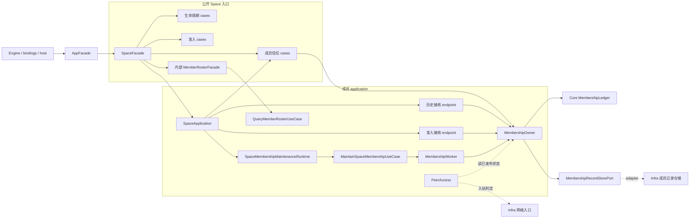
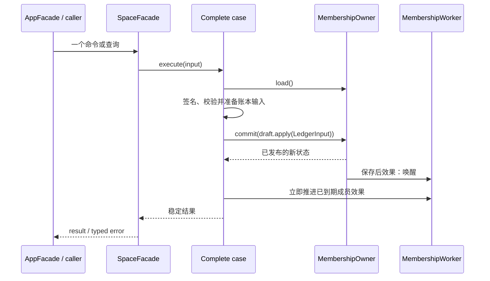
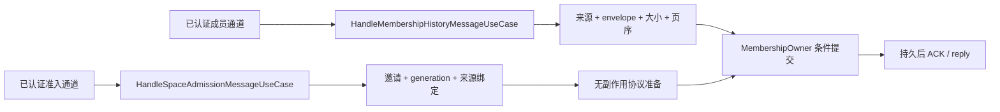
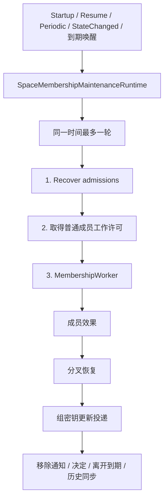
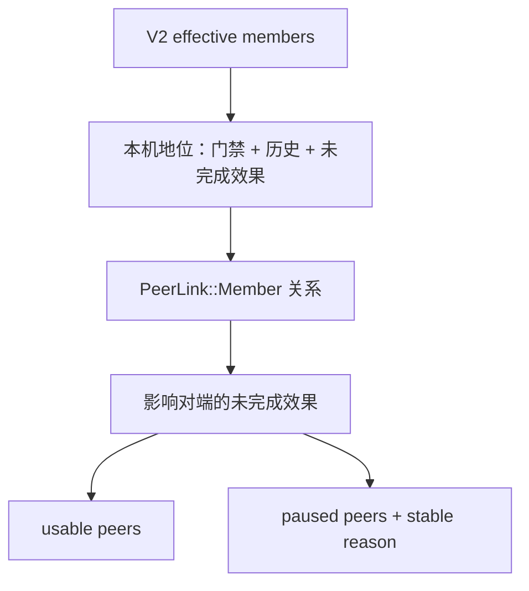

# Space Application 设计与代码地图

本文说明 `crates/uc-application/src/space/` 的当前结构。它面向维护者和 Agent，目标是让修改者先找到完整业务入口、事实负责人和恢复路径，再动代码。

本文描述的是 **application 当前实现**。Core 规则、Infra adapter、Engine 组装和绑定是否已完成接入，必须在各自仓库位置单独验证，不能从本文推断。

## 先记住的规则

1. `SpaceFacade` 是 application 唯一公开的 Space 业务入口。不要新增第二个 Space facade，也不要公开内部 use case、runtime 或成员状态负责人。
2. `space/mod.rs` 是唯一模块出口。子模块一律私有；Space 之外只允许使用 `crate::space::{...}`，不得穿透子目录。Space 内跨责任区协作也只能经过 `admission`、`lifecycle`、`membership` 或 `connectivity` 的根出口。
3. 一个业务动作只由一个完整 case 负责。调用方只提交必要输入并接收稳定结果，不编排内部步骤。
4. V2 签名成员历史是成员资格的唯一正向事实。成员表、可信关系、地址、在线状态和偏好都不能授予资格。
5. 所有普通成员消费者只读 `CurrentSpaceMemberScopePort`（由 `MembershipOwner` 从已发布状态给出）。范围不可读时失败关闭；移除通知与决定投递不走普通范围。
6. 成员事实只有一个写入者：`MembershipOwner`。成员规则只经 Core 成员账本 `MembershipLedger::apply` 推进；Owner 在一次条件提交中保存成员记录与成员读模型。其他用例、查询、准入和 Infra 都不得构造或改写成员记录（见 [ADR-027](decisions/027-single-owner-space-membership-state.md)）。
7. 成员记录（`MembershipRecord`）及其所有字段都是敏感负载。持久 adapter 必须使用 Profile/Space MasterKey AEAD；不得增加明文镜像、缓存或日志。
8. 正式 Add/Remove/Decision 一旦提交就不回滚。后续安全效果、网络送达和清理由持久阶段恢复。
9. 网络认证只证明“对端是谁”，不证明“对端仍有权限”。历史收发必须再次核对当前成员范围。
10. 日志不得包含邀请码、设备标识、成员实例、地址、签名、密钥、文件名、路径或内容。
11. 修改本目录的行为、接口、不变量或重要取舍时，同步更新本文或对应 ADR、执行计划。

## 术语

| 术语 | 本目录中的含义 |
| --- | --- |
| Facade | 对调用方提供稳定业务入口，只选择一个完整 case 并转换输入输出 |
| Case | 一个用户动作、系统动作、查询或网络消息从开始到稳定结果的完整流程 |
| Deep module | 用小接口隐藏大量规则和状态知识的模块；本目录的核心例子是 `MembershipOwner`（其规则来自 Core `MembershipLedger`） |
| Port | Case 为完成职责需要的外部能力；由需要该能力的层定义 |
| Adapter | 在 Infra/Engine 等外层实现 port 的具体对象 |
| Runtime | 只负责触发、并发、暂停、恢复和关闭，不掌握业务步骤 |
| Endpoint | 一个已认证网络消息的单次入口；adapter 不得拼接持久化步骤 |

## 建议阅读顺序

1. `space/facade/facade.rs`：公开入口的唯一实现及 lifecycle 收尾。
2. `space/application.rs`：成员相关 case、endpoint、Owner、Worker 和 runtime 的唯一组装点。
3. 本次要改的 `*/use_case.rs`：完整业务顺序。
4. `membership/owner.rs`、`membership/worker.rs` 与 Core `membership/ledger/`：唯一写入者、待办执行器，以及状态、输入、待办与展示规则。
5. 对应 `tests.rs` 或 `target_tests.rs`：用户可见结果、持久事实和边界条件。
6. 最后再看 `space/mod.rs`、`facade/space_setup/mod.rs`、`deps.rs` 与外层 adapter，确认出口是否完整；不要反向按 adapter 形状设计 case。

## 总体设计图



`SpaceFacade` 是公开 seam，`SpaceApplication` 是内部 composition，`MembershipOwner` 是成员事实 deep module。三者职责不能合并：facade 不读存储，composition 不决定业务，Owner 不决定产品动作或网络重试。
Worker 只执行账本给出的已到期待办并把结果交回 Owner；`PeerAccess` 只读取 Owner 发布的状态做入站判定。

`spaceDeviceUpdate.reason=local_identity_mismatch` 表示本机当前网络身份与已验证成员历史中的本机指纹不一致。
查询只读取现有身份，不创建或替换密钥；结果为 `needs_attention`，不提供恢复动作或下次重试时间，
因为自动重试不能消除这类不一致。恢复方式待现场核实后决定；旧版维护健康视图只保留需要处理阶段。

## 事实所有权

| 事实或状态 | 唯一负责人 | 可以读取它的模块 | 不能拿它做什么 |
| --- | --- | --- | --- |
| 当前成员资格 | Core `VersionedMembershipHistory`，由成员账本核对沿革与事件后采用 | 查询、移除、决定、历史收发、scope、入站判定 | 不能从成员表、可信关系或在线状态补造 |
| 成员状态（本机、对端、成员效果、同步游标） | Core `MembershipLedger` 定义合法变化，`MembershipOwner` 唯一写入 | 成员 cases、Worker、查询、`PeerAccess` | 只能经 `LedgerInput` 推进；调用方不得直接改字段 |
| Application 成员持久记录 | `MembershipOwner` 经 `MembershipRecordStorePort` 条件提交 | Owner 加载后发布只读 `MembershipView` | 不能拆成多个仓储顺序写入；Infra 不得构造或改写 |
| 成员读模型（成员表、可信身份） | 由 `MembershipProjectionPlan` 从账本推导，随成员记录同一事务落实 | 名单资料、身份目录候选 | 不授予资格；不能单独写入 |
| 普通可用成员范围 | 账本 `present` 派生，Owner 实现 `CurrentSpaceMemberScopePort` | clipboard、file、roster、连接和历史同步 | 不能持久化第二份，也不能与旧 gate 并用 |
| 对端关系与同步退避 | 账本 `PeerLink::Member` | 查询、scope、Worker 待办 | `Consistent` 也不能在无 AddDevice 时授予资格 |
| 正在离开的对端 | 账本 `PeerLink::Departing`，送达移除通知或 5 分钟到期后删除 | Worker 投递移除通知、身份目录 | 只能收到精确移除通知 |
| 入站历史分页与完成回执 | 成员记录中的 `MembershipHistoryExchangeRecord` | 历史接收 case | 未完整验证前不能替换正式历史 |
| 成员效果进度 | 账本未完成效果（已准备、成员资料已应用、安全已应用），激活即删除 | Worker 与 scope | 不能失败后回滚正式历史 |
| 准入协议状态 | Core `SpaceAdmissionAggregate` 定义合法状态变化，独立准入仓库负责密文原子保存 | `SpaceAdmissionProtocol` 的命令、查询和恢复 | 成员记录不得保存准入状态或 outbox；准入正式提交先经 Owner 提交成员事实，成功后才保存准入终态 |
| 设备信任 revision | 成员记录顶层 `revision` | 查询和产品失效通知 | 不能与准入状态拼成第二份 revision |
| 在线状态 | reachability/presence adapter | 查询展示、拨号筛选 | 不能授予成员资格或历史接收权 |
| 重新配对提示 | `RePairingState` | setup query、rebuild、AddDevice 最终激活 | 不能在安全效果完成前清除 |

## Code Map

### 责任区

| 目录 | 完整责任 | 不包含 |
| --- | --- | --- |
| `lifecycle/` | 创建、解锁、锁定、恢复、查询、重建、重置、升级和 session 活动协调 | 准入协议、成员历史和网络 session 重建 |
| `admission/` | 邀请、加入、取消、准入消息、可靠恢复和跨 Space transition | 正式成员历史规则和普通内容权限 |
| `membership/` | 成员状态唯一写入者、待办执行器、入站访问判定、信任查询与变更、历史收发、签名、re-pairing 和唯一维护 runtime | Space 密钥会话生命周期和网络 session 重建 |
| `connectivity/` | 判断何时重建网络 session，并处理合并、退避和关闭 | 成员资格、准入阶段和 lifecycle |

四个责任区的 `mod.rs` 都只导出跨区协作所需内容，不公开子模块。责任区内部的 case、runtime、状态和测试继续与其负责人放在一起。

### 入口与组装

| 路径 | 职责 | 重点关系 |
| --- | --- | --- |
| `crates/uc-application/src/space/facade/facade.rs` | 唯一 SpaceFacade 实现，组合 lifecycle 收尾，暴露两个认证网络 endpoint | 上接公开白名单，下接私有 cases；不直接读写存储 |
| `crates/uc-application/src/facade/space_setup/mod.rs` | 保留既有公开调用路径，只重新导出批准的 Space 调用契约 | 不包含实现，不直接引用 Space 子目录 |
| `crates/uc-application/src/space/application.rs` | 从通用 `ApplicationDeps` 与 Engine 选择的 `SpaceRuntimeAdapters` 内部形成私有依赖，一次构造 Owner、Worker、成员 cases、两个 endpoint 和唯一成员 runtime，并把 Owner 绑定到 `PeerAccess` | 只做 wiring，不放业务分支；不向 Engine 暴露内部 deps/use case/runtime |
| `crates/uc-application/src/space/mod.rs` | Space 唯一出口，子模块全部私有，只逐项导出调用与组装契约 | Space 外部不得使用 `crate::space::<child>::...` |
| `crates/uc-application/src/deps.rs` | 对 composition root 汇总 application ports | 只从 `crate::space` 根出口取得 Space 能力 |

Engine 继续选择 Iroh、具体 Infra transition/recovery adapter、宿主能力和观测 decorator，并在注入前完成
decorator 包装。Application 只接收这些最终能力：`SpaceFacade` 在内部组合成员、搜索与接收的 session
activity，并由 `SpaceSessionRecovery` 持有唯一激活、重试、暂停、恢复和关闭顺序。Search 与 receive 在启动装配阶段通过 facade 一次绑定；Engine
不持有 activity、内部依赖 bundle 或成员 runtime handle，绑定完成前的 lifecycle activity 明确返回
`Unavailable`。

创建、解锁和已保存会话恢复只在本地资料可读后向 `SpaceSessionRecovery` 提交一次激活请求，
不等待远端设备上线或成员维护完成。恢复负责人会合并重复请求，并在本地活动暂时启动失败时按有上限的
间隔继续尝试；锁定与关闭会先取消并等待旧激活任务。成员维护只接收恢复与非阻塞唤醒，远端欠账和
连接失败继续由成员维护和连接协调者各自重试。Engine 与产品调用方只提交原有完整动作，不再拼接第二步。

### 生命周期与查询

| 目录 | 主要文件 | 职责 |
| --- | --- | --- |
| `lifecycle/initialize_space/` | `use_case.rs`, `ports.rs`, `model.rs`, `error.rs` | 新建 Space 并建立本机单成员起点 |
| `lifecycle/unlock_space/` | `use_case.rs`, `readiness.rs`, `ports.rs`, `error.rs` | 解锁现有 Space，完成本地资料就绪并提交后台激活 |
| `lifecycle/session/` | `activity.rs`, `recovery.rs`, `ports.rs` | 合并并重试后台激活，串行锁定暂停、失败恢复与关闭 |
| `lifecycle/lock_space_session/` | `use_case.rs`, `ports.rs`, `error.rs` | 通过会话恢复负责人停止活动后锁定，失败时恢复 |
| `lifecycle/recover_space_session/` | `use_case.rs`, `model.rs`, `error.rs` | 从已保存钥匙恢复本地会话并提交后台激活 |
| `lifecycle/query_space_access_state/` | `use_case.rs`, `model.rs`, `error.rs` | 查询是否已有 Space、会话是否 ready |
| `lifecycle/query_space_setup_state/` | `use_case.rs`, `model.rs`, `error.rs` | 查询 setup UI 所需的 Space、邀请、设备名和 re-pairing 状态 |
| `lifecycle/change_encryption_passphrase/` | `use_case.rs`, `ports.rs`, `error.rs` | 设备列表只显示有效本机时修改为用户自定义口令；不要求重新配对状态 |
| `lifecycle/rebuild_space/` | `use_case.rs`, `transition.rs`, `membership_rebuilder.rs`, `ports.rs` | 可恢复地重建单设备 Space |
| `lifecycle/reset_space/` | `use_case.rs`, `ports.rs`, `error.rs` | 用户重置和重置提交状态查询 |
| `lifecycle/upgrade_space/` | `use_case.rs`, `error.rs` | 跨版本里程碑触发必要重建并记录版本 |

### 准入

| 目录 | 主要文件 | 职责 |
| --- | --- | --- |
| `admission/invitation/` | `issue/`, `issue_for_address/`, `query_addresses/`, `cancel/`, `issuer.rs`, `holder.rs` | 临时邀请生命周期；邀请只在内存 holder 中存在 |
| `admission/join_space/` | `target_use_case.rs`, `model.rs`, `error.rs` | 明确用户 Join 动作；先保存尝试再允许网络恢复 |
| `admission/cancel_space_join/` | `target_use_case.rs`, `error.rs` | 提交边界前取消加入 |
| `admission/handle_space_admission_message/` | `use_case.rs`, `port.rs`, `model.rs`, `error.rs` | 一条认证准入消息的完整处理 |
| `admission/recover_space_admissions/` | `use_case.rs`, `tests.rs` | 扫描、发送并结清可靠 outbox |
| `admission/complete_pending_space_transition/` | `use_case.rs`, `error.rs` | 推进加入方跨 Space transition 到 Active |
| `admission/query_pending_space_transition/` | `use_case.rs`, `error.rs` | 查询是否需要完成 Space transition |
| `admission/outbox.rs` | 消息、ACK、delivery port 和结果 | 可靠消息的窄 seam，不拥有完整准入流程 |
| `admission/security_transition/` | `ports.rs` | 安全状态准备/激活能力定义 |
| `admission/space_transition/` | `ports.rs` | 跨 Space 数据 transition 能力定义 |

### 成员事实与恢复

| 目录 | 主要文件 | 职责 |
| --- | --- | --- |
| `membership/owner.rs`, `owner/` | `draft.rs`, `view.rs`, `tests.rs` | 唯一写入者：加载并校验成员记录，在草稿上经账本推进，条件提交记录与读模型，发布只读状态并履行保存后效果；按数据库代号在控制世代替换后重新加载 |
| `membership/worker.rs`, `worker/` | `effects.rs`, `history_sync.rs`, `tests.rs` | 取账本 `outstanding_work` 中已到期的待办：推进成员效果、投递移除通知与决定、结束离开窗口、历史同步；结果交回 Owner，按最早剩余时间安排唤醒 |
| `membership/access.rs` | `access/tests.rs` | `PeerAccess`：入站访问判定与身份目录，只读 Owner 发布的状态；Owner 绑定前一律按暂不可用拒绝 |
| `membership/ports.rs`, `record.rs`, `projection.rs` | `record/` | 成员记录存储与效果能力 port、成员记录纯数据、成员读模型计划 |
| `membership/reconcile_history_evidence/` | `use_case.rs`, `mod.rs` | 完整处理认证证据、旧选择衔接和同快照回复，关系变化经 Owner 提交；入站与主动核对共用 |
| `membership/query_device_trust/` | `use_case.rs`, `model.rs`, `ports.rs`, `error.rs` | 从 Owner 已发布状态的 `present` 结果单次生成完整设备信任状态 |
| `membership/remove_space_member/` | `use_case.rs`, `model.rs`, `revocation.rs`, `error.rs` | 本机发起正式成员移除 |
| `membership/decide_device_trust_change/` | `use_case.rs`, `model.rs`, `error.rs` | 接受或拒绝远端移除变化 |
| `membership/handle_history_message/` | `use_case.rs`, `transfer.rs`, `model.rs`, `error.rs` | 入站成员历史消息、分页和 ACK |
| `membership/recover_conflict/` | `use_case.rs`, `issuer.rs`, `ports.rs`, `tests.rs` | 两阶段恢复握手、恢复包验证与七阶段 generation transition 的唯一编排；由 Worker 每轮调度，目标世代记录由 Owner `stage` 形成 |
| `membership/group_update_delivery.rs` | — | 组密钥更新欠账的有界投递 |
| `membership/maintenance/` | `use_case.rs`, `runtime.rs`, `ports.rs`, `model.rs` | 唯一后台生命周期：准入恢复、工作许可，再交给 Worker |

### 支撑模块

| 目录 | 职责 | 不是它的职责 |
| --- | --- | --- |
| `lifecycle/current_space/` | 当前 Space ID、初次激活、可移植身份 ports | 不判断成员资格 |
| `membership/signing/` | 当前本机成员实例、永久凭据、签名与精确验签 seam | 不保存历史，不选择业务动作 |
| `lifecycle/session/` | 组合成员、搜索、接收的 pause/resume；失败恢复 | 不执行 lock/unlock 本身 |
| `membership/re_pairing/` | 重新配对提示状态 | 不代表当前成员集合 |
| `connectivity/recovery/mod.rs` | 重建网络 session、共享请求、退避和网络变化窗口 | 不读写成员资格，不代替成员 runtime |
| `space/membership/query_member_roster.rs` | 用最终 scope 过滤成员资料并叠加在线状态 | 不授予成员资格；不处理名单之外的成员操作 |
| `facade/roster/`（相邻目录） | 对外转发名单查询，并提供稳定展示类型和状态订阅 | 不聚合仓储、成员范围或逐成员在线状态 |

## 调用关系

### 用户动作的共同形状



只读查询只调用 `load()`；网络接收只有在 Owner 提交完成后才能回复 ACK。Owner 的 `commit` 在同一把锁内加载最新状态、
执行调用方的变化并条件提交，修订号冲突时丢弃已发布状态，由调用方按冲突重新判定。任何需要调用方“先写 A、再写 B、
再唤醒 C”的接口都违反本目录结构。

### 网络入口



网络 adapter 每收到一条消息只调用一次 endpoint。分页、邀请消费、阶段推进、关系保存和错误分类都不能搬到 adapter。
入站连接的身份解析与放行由 Infra `InboundPeerGate` 调用 `PeerAccess`：身份候选与成员读模型相同，放行要求本机为有效
成员、对端为当前成员且关系一致；二者读取的都是 Owner 已发布的状态，而不是成员读模型。

### 后台维护



维护运行期只负责触发、合并、暂停、关闭与工作许可，不知道任何成员步骤。准入恢复后若不在普通工作模式（配对中或需要处理），
本轮结束；许可在 Worker 执行期间保持，避免与配对交错。Worker 做什么完全由账本 `outstanding_work` 决定：
先推进本机成员效果，再恢复分叉与投递组密钥更新，最后执行网络待办，使对端在看到新历史前已能收到对应的组密钥更新。
同一轮中每项待办最多尝试一次，未完成的留给下一次触发；没有已到期待办时按最早剩余时间安排唤醒。

## Case 手册

### 生命周期 Cases

#### `InitializeSpaceUseCase`

- **入口**：`InitializeSpaceRequest -> InitializeSpaceResult`，公开由 `SpaceFacade::initialize_space` 转换输入。
- **职责/作用**：全新 profile 创建加密 Space；校验密码确认，保存设备名，创建 Space，确保本机身份，保存本机 `SpaceMember`，初始化单成员历史与安全组，最后激活当前 Space。
- **关系**：调用 `InitializeSpaceMembershipUseCase` 经 Owner 建立成员历史根；本地事实提交后由 use case 向唯一会话恢复负责人提交后台激活。
- **重点关注**：它是“原子意图”而非跨 adapter 数据库事务，失败恢复依赖各 port 幂等；当前 Space 已存在时必须早退；敏感输入不得降级成普通字符串或日志字段。

#### `UnlockSpaceUseCase`

- **入口**：`Passphrase -> SpaceId`，facade 包装成 `UnlockSpaceResult`。
- **职责/作用**：读取当前 Space、解锁密钥材料、执行版本升级和数据 readiness；成员资料在本次解锁返回前必须已经可读。
- **关系**：`LocalSessionReadiness` 只调用 `UpgradeSpaceUseCase`、移动内容回填并读取成员资料；随后向唯一会话恢复负责人提交后台激活，不等待远端维护。
- **重点关注**：错误要区分未初始化、密码错误、密钥损坏和内部失败；不创建或猜测 Space。

#### `LockSpaceSessionUseCase`

- **入口**：无输入，返回 `()` 或 `LockSpaceSessionError`。
- **职责/作用**：取得当前 Space，先暂停成员/接收/搜索活动，再锁定 Space。
- **关系**：使用 `SpaceSessionRecoveryPort` 取消并等待后台激活；lock 失败时由同一负责人恢复活动。
- **重点关注**：顺序不可反转；半暂停失败必须恢复已暂停部分；不能在本 case 外再拼一套暂停流程。

#### `RecoverSpaceSessionUseCase`

- **入口**：无输入，返回 `RecoverSpaceSessionResult { unlocked, resumed }`。
- **职责/作用**：尝试用已保存钥匙恢复已有 Space session；成功后完成本地 readiness，并提交一次后台活动激活。
- **关系**：解锁与自动恢复共用 `LocalSessionReadiness`；会话恢复负责人启动本地活动并非阻塞唤醒成员维护，成员与连接运行期继续负责远端延期。
- **重点关注**：无当前 Space 或无可恢复 session 是明确的未恢复结果，不等于错误；密钥损坏和 keyring miss 必须保留稳定分类。

#### `QuerySpaceAccessStateUseCase`

- **入口**：无输入，返回 `SpaceAccessState { initialized, session_ready }`。
- **职责/作用**：组合“是否有当前 Space”和“该 Space 是否已解锁”。
- **关系**：只读 `CurrentSpaceIdentityPort` 与 `IsSpaceUnlockedPort`。
- **重点关注**：这是加密会话查询，不是 setup UI 查询，也不读成员历史。

#### `QuerySpaceSetupStateUseCase`

- **入口**：无输入，返回 `SetupStateView`。
- **职责/作用**：提供 setup 页面需要的当前 Space、最早到期邀请、设备名和 re-pairing 状态。
- **关系**：读取 current Space、邀请 holder、settings 和 `RePairingState`。
- **重点关注**：不修复状态、不拨号；邀请只是内存临时状态，重启丢失是设计行为。

#### `ChangeEncryptionPassphraseUseCase`

- **入口**：一次提交用户自定义的新口令及再次输入值。
- **职责/作用**：先确认两次输入一致，再使用与公开设备列表相同的当前成员范围确认只存在有效本机；撤销全部现有邀请后调用单一口令替换能力。
- **关系**：与邀请签发共享串行边界；Infra 保存受保护恢复记录并在重启时前向完成。
- **重点关注**：不读取或要求 re-pairing 提示；可用或暂停的其他成员任一存在都拒绝；不生成口令；不清除既有 re-pairing 提示，不遍历或重加密历史内容。

#### `RebuildSpaceUseCase`

- **入口**：无输入，内部返回唯一目标 `SpaceId`。
- **职责/作用**：准备或恢复单一重建目标，stage 目标，重绑 session，清理旧成员事实，保存本机成员，建立新 V2 根，promote 并 finalize。
- **关系**：`SpaceRebuildTransition` 负责 stage/promote/finalize；`SpaceMembershipRebuilder` 负责成员资料；`RelationshipStateResetPort` 清旧成员运行事实。
- **重点关注**：重启必须继续同一目标；来源 Space 在 promote 前不能被半修改；旧成员表不能生成新授权。

#### `ResetSpaceUseCase`

- **入口**：无输入，返回 `()`。
- **职责/作用**：取消全部内存邀请，再调用 `RebuildSpaceUseCase` 重建单设备 Space。
- **关系**：facade 成功后唤醒维护。
- **重点关注**：重置不是简单清表；不得跳过 transition 或直接创建第二个目标。

#### `QueryCommittedDeviceManagementResetUseCase`

- **入口**：无输入，返回 `bool`。
- **职责/作用**：比较持久重建目标和当前 Space，判断设备管理重置是否已提交。
- **关系**：由 `SpaceFacade::has_committed_device_management_reset` 转发。
- **重点关注**：保持纯查询，不能在 facade 内重新拼两次存储读取。

#### `UpgradeSpaceUseCase`

- **入口**：无输入，返回 `()`。
- **职责/作用**：读取上次 Engine 版本，检测是否跨过要求隔离旧 profile 的里程碑，必要时 rebuild，最后保存当前版本。
- **关系**：由 unlock/resume readiness 调用；重建复用 `RebuildSpaceUseCase`。
- **重点关注**：版本记录只能在必要动作成功后推进；升级失败不能伪装成已完成。

### 邀请与准入 Cases

#### `IssuePairingInvitationUseCase`

- **入口**：无输入，返回 `IssuePairingInvitationResult`。
- **职责/作用**：先通过 `PairingInvitationIssuer::begin` 做一次成员准入门禁，再请求默认网络签发，最后登记内存邀请和观测事件。
- **关系**：与指定地址签发共享 `PairingInvitationIssuer`。
- **重点关注**：门禁和 generation 必须来自同一次读取；不能记录邀请码；网络未启动要返回稳定错误。

#### `IssuePairingInvitationForAddressUseCase`

- **入口**：`IpAddr -> IssuePairingInvitationResult`。
- **职责/作用**：与普通签发相同，但把用户选择的本机地址交给专用 port。
- **关系**：复用 issuer 的 begin/finish，不复制准入规则。
- **重点关注**：地址不进入 tracing 字段；指定地址只影响网络签发，不改变成员事实。

#### `QueryPairingInvitationAddressesUseCase`

- **入口**：无输入，返回 `Vec<PairingInvitationAddressCandidate>`。
- **职责/作用**：列出可用于邀请的本机地址候选。
- **关系**：只调用地址查询 port，由 facade 转发。
- **重点关注**：纯查询；不签发、不改变 holder、不把地址写日志。

#### `CancelPairingInvitationUseCase`

- **入口**：无输入，返回 `()` 或 `NotIssued`。
- **职责/作用**：逐项撤销实际发行方中的全部待用邀请，再清空进程内 holder；发行方已不存在或已过期视为撤销完成。
- **关系**：操作 `InMemoryPairingInvitationHolder`；reset 也复用 holder 的清理 port。
- **重点关注**：发行方暂时不可用时保留本机 holder 供重试，不修改持久成员状态；成功撤销后竞态加入会在准入 endpoint 中因 invitation miss 被拒绝。

#### `SpaceAdmissionProtocol`

- **入口**：用户 Join/Cancel、认证入站消息、当前状态查询、待完成激活和后台恢复。
- **职责/作用**：在 profile 级串行边界内驱动 Core aggregate，原子保存加密状态，并通过认证 transport 继续可恢复交换。
- **关系**：facade 只调用协议动作；Infra 只提供密码材料、密文仓库、认证传输和最终激活能力。
- **重点关注**：用户动作才可创建新尝试；恢复只能推进已保存状态；成员状态负责人不参与准入协议状态推进。
- **版本阻塞**：首次认证交换确认旧布局时稳定拒绝并提示升级；Prepared、Applied、Cancelling 或本机已激活但未结清时只在原待交换
  状态上保存升级阻塞，不丢请求、业务材料或正式结果。产品只看到 Pending、Processing 或 Active 的固定升级提示，不看到内部阶段；兼容后继续
  原请求，成功推进自然清除提示。旧 V1 待交换记录按严格无尾随字节规则兼容读取；提示出现、清除或进入明确拒绝后只发一次通用
  刷新，普通内部推进和重复旧端错误不发。已确认对端上线会立即重放对应加入，不等待 30 秒周期轮。

### 成员与历史 Cases

#### `QueryMembershipAdmissionUseCase`

- **入口**：`invitation_generation -> MembershipAdmissionSnapshot`。
- **职责/作用**：一次读取 Owner 已发布状态，同时返回当前 generation 和准入决定。
- **关系**：由 `PairingInvitationIssuer` 使用。
- **重点关注**：只看当前 V2 成员、相关对端关系和未完成效果；已不在当前历史中的旧关系不能永久阻塞邀请。

#### `QueryDeviceTrustUseCase`

- **入口**：无输入，返回 `DeviceTrustStatus`。
- **职责/作用**：从 Owner 已发布状态经账本 `present` 一次得到本机成员状态、每台设备的成员状态、关系、同步状态、暂停原因
  与设备更新阶段，叠加当前加入、待接纳成员和非授权观察资料（在线、组密钥投递状态）。
- **关系**：移除和决定提交后复用它返回最新产品状态；加入状态投影函数也被准入 cases 复用。本机身份不一致的覆盖由本查询负责。
- **重点关注**：查询不修复状态、不触发网络、不另写推导规则；观察资料缺失或重复要失败关闭；在线状态不参与授权。

#### `RemoveSpaceMemberUseCase`

- **入口**：`target DeviceId -> RemoveSpaceMemberResult`。
- **职责/作用**：串行验证本机和目标，使用当前成员凭据创建并签名 RemoveDevice，以“本机移除已签名”输入经 Owner 提交；
  账本同时登记成员效果与给目标的移除通知。提交后立即推进可完成的效果并查询最新状态。
- **关系**：调用 Core 历史规则、`CurrentMemberSignaturePort`、Owner、Worker 效果推进和设备信任查询。
- **重点关注**：不能移除本机；目标必须是当前有效成员；状态冲突完整重读重试一次；提交后查询失败返回 CommittedButPending，绝不回滚。

#### `DecideDeviceTrustChangeUseCase`

- **入口**：`DecideDeviceTrustChange -> DecideDeviceTrustChangeResult`。
- **职责/作用**：处理 Apply/Keep、移除本机二次确认、重复决定、过期变化和一次冲突重试；签名决定并以“本机决定已签名”输入经 Owner 提交。
- **关系**：提交后推进效果并查询最新状态。
- **重点关注**：未确认本机移除时零写入；Reject 只把提议方标记分叉，不运行 Remove 效果；本机为移除目标时接受后不回复决定，
  本机已移除为终态；重复决定补做效果但不二次提交。

#### `HandleMembershipHistoryMessageUseCase`

- **入口**：`AuthenticatedMember + MembershipHistoryMessage -> ACK message`。
- **职责/作用**：校验 envelope、来源当前资格、大小、transfer 和页序；每页保存到成员记录的历史交换资料后回复 Continue；
  收齐后验证完整历史，以“对端历史证据已核对”输入经 Owner 提交，并保存最终 ACK。
- **关系**：通过 Core `MembershipHistoryExchangeEndpointPort` 暴露给网络 adapter；证据处理与 `ReconcileMembershipEvidenceUseCase` 共用。
- **重点关注**：已移除设备在保存任何页前拒绝；重复同页幂等，冲突页/替换 transfer 标 Invalid；完整验证前不能改变成员资格。

### 内部恢复 Cases

成员规则与完整证据处理的细分归属见[成员历史职责](membership-history-ownership.md)。Core 成员账本负责状态、输入、待办与展示规则，
`ReconcileMembershipEvidenceUseCase` 对收到证据后的业务处理负责，Owner 只提供加载、条件提交与发布。

#### `MaintainSpaceMembershipUseCase`

- **入口**：`MembershipMaintenanceTrigger -> MembershipMaintenanceReport`。
- **职责/作用**：一轮成员维护：先恢复准入并取得普通成员工作许可，再交给 `MembershipWorker` 完成全部已到期待办。
- **关系**：唯一由 `SpaceMembershipMaintenanceRuntime` 调度。
- **重点关注**：配对期间普通成员工作暂停；许可在整轮 Worker 执行期间保持；不在这里排列成员步骤。

#### `MembershipWorker`

- **入口**：维护运行期的 `RunMembershipWorkPort`；用户动作提交后经 `RecoverMembershipEffectsPort` 只推进成员效果。
- **职责/作用**：取账本 `outstanding_work` 中已到期的待办执行：成员效果按因果深度每次推进一步
  （已准备 → 成员资料已应用 → 安全已应用 → 激活）；移除通知与决定经 `RestrictedMembershipDeliveryPort` 精确投递；
  离开窗口到期；历史同步（固定 10 秒总预算）。每项结果作为账本输入交回 Owner。分叉恢复与组密钥投递由各自持久资料登记，一并调度。
- **关系**：不决定做什么，也不写成员记录；效果阶段由 Owner 在提交中推进。
- **重点关注**：效果阶段只前进不回退，adapter 必须按事件幂等；受限投递不授予名单、内容、在线或完整历史权限；
  AddDevice 最终激活成功后才清除 re-pairing 提示；移除通知与离开到期不阻塞设备更新完成。

#### `DeliverPendingGroupUpdatesUseCase`

- **入口**：Worker 每轮调用，返回稳定 outcome。
- **职责/作用**：唯一负责读取加密持久的 Group Epoch 欠账、有界投递，且只在认证对端接受后删除欠账。
- **关系**：Infra dispatch 只完成 Iroh request/ACK；Engine 只安装 handler 并注入 port；Worker 不理解投递内部步骤。
- **重点关注**：Offline/Transport/Rejected 均保留欠账并持久轮转到队尾；单轮上限不能使排序靠后的设备饿死。对端刚与本机成功交换成员历史（出站同步确认或入站证据确认，经 `MembershipOwner` 提交）时，发给它的未拒绝欠账不等持久退避到期即在下一轮投递；外部上线与联系事件仍只是无业务含义的唤醒。

#### `InitializeSpaceMembershipUseCase`

- **入口**：实现 Core `SpaceMembershipInitializerPort::initialize()`。
- **职责/作用**：准备单设备安全组，核对本机身份和公告，取得永久成员凭据并签名 facts，经 Owner 建立单成员 V2 根和本机成员状态。
- **关系**：新建 Space 与 rebuild 复用同一入口。
- **重点关注**：公告 device 必须等于本机 device；凭据与 member instance 必须一致；不能从旧成员表生成根。

### 网络恢复 Workflow

#### `NetworkRecoveryFacade`

- **入口**：`request_recovery`、网络恢复观察、旧在线 peer 路径耗尽、新拨号成功、status/subscribe/shutdown。
- **职责/作用**：决定何时重建整套网络 session；合并并发请求，按 1/2/5/10/30 秒退避重试，并限制自动恢复在 60 秒网络变化窗口内。
- **关系**：调用 `RebuildNetworkSessionPort`，由 Engine 完成实际 session 替换。
- **重点关注**：它不是成员资格 case，也不是成员 runtime；新拨号成功要取消陈旧自动恢复；manual 请求可加入当前 in-flight cycle。

## 成员状态负责人设计

规则与结构的决定见 [ADR-027](decisions/027-single-owner-space-membership-state.md)，实施记录见
[执行计划 049](../exec-plans/completed/049-single-owner-space-membership-rewrite.md)。

### 持久模型

成员记录 `MembershipRecord` 保存当前 Space 的成员账本快照，以及同一修订号提交的非聚合资料。字节布局、格式版本与
V1–V4 → V5 迁移由 Infra 成员记录仓储负责，Application 不含任何编码。

| 部分 | 含义 | 维护要求 |
| --- | --- | --- |
| `revision` | 唯一单调修订，也是设备信任 revision | 条件提交比较 expected revision；溢出为 Corrupt |
| 账本快照 | 历史、本机设备与成员实例、加入门禁、对端 `PeerLink`、未完成成员效果、同步游标 | 只经 `LedgerInput` 推进；`restore` 拒绝非法快照 |
| `MembershipHistoryExchangeRecord` | 未收齐的入站分页与已完成传输的回执 | 每来源最多一个活动 transfer；重放返回同一结果 |
| `MembershipBranchRecoveryRecord` | 分叉记录与分支恢复会话 | 分叉恢复内部阶段不变，检查点随成员记录保存 |

本机地位不单独保存：由历史、加入门禁与影响本机的未完成效果得出。已激活的效果不再保存。

### 条件提交

`MembershipOwner::commit` 在一把锁内加载最新状态，调用方在 `MembershipDraft` 上以 `apply` 提交账本输入、修改同存资料；
无变化时不写入。有变化时 Owner 由账本推导 `MembershipProjectionPlan`，经 `MembershipRecordStorePort::commit` 在同一个加密事务中
比较 expected revision、替换完整记录并落实成员读模型（成员、可信身份与地址）。提交成功后发布新状态并履行账本声明的
保存后效果（发布设备信任变化、唤醒 Worker）；失败时丢弃已发布状态，下一次读取重新加载。

准入正式提交与加入方激活作为准入转换的 `BeforeCommit` 效果先经 Owner 提交成员事实，成功后才保存准入终态；
同一准入事件的重复输入不改变状态。分叉换组由 Owner 以 `stage` 为暂存控制世代预先形成记录与读模型计划，Infra 原样写入。
控制库被替换（加入方激活、分叉换组、设备管理重置、取消加入、恢复出厂）时数据库代号推进，Owner 发现代号变化即重新加载并通知读取方。

### 最终 scope 与入站判定

普通范围与入站判定都来自 Owner 已发布的同一状态。对端只有在本机成员有效、对端属于当前有效成员且关系一致时才放行入站；
公开 `usable` 还要求没有影响它的未完成效果，因此公开可用的对端必然能通过入站判定。历史交换与分支恢复只核对身份。



暂停原因包括本机未激活、待本机决定、分叉、无效、需升级、关系未确认和效果未完成。普通调用方只能继续缩小 `usable_peer_device_ids`，不能把 paused peer 加回去。

## 修改时重点检查

### 新增或修改一个 case

1. 先写清：谁负责完整结果、调用方唯一动作、成功/失败结果、重启/重试负责人。
2. 业务顺序必须能从一个 `execute()` 读懂；纯规则调用 Core，外部能力走附近 port。
3. case 不依赖 Infra 类型，不创建 adapter，不暴露内部步骤给 facade。
4. 涉及成员事实时只经 `MembershipOwner::commit` 以账本输入提交；需要新规则时先加 Core `LedgerInput` 与测试，不在 case 中改状态。
5. 正式提交后的暂时失败表达为 pending/deferred，不返回“未发生”。
6. 为并发、重复、重启和提交边界增加目标接口测试。

### 修改成员授权

- 从 `VersionedMembershipHistory` 开始，不从 `MemberRepositoryPort`、trusted peer、地址、presence 或安全组开始。
- 检查本机 member instance 与历史 facts 的一一对应。
- 检查未完成效果和对端关系是否只能缩小权限；`present` 与规范化保持穷尽匹配，不加通配分支。
- 检查普通发送、接收、roster、文件、补送和连接是否都复用一次 scope snapshot。
- 已移除设备只允许收到精确的移除通知（`PeerLink::Departing`，送达或 5 分钟到期后删除）；入站判定一律拒绝。

### 修改历史分页

- 网络层和 application 都要在分配前执行大小限制。
- 新页必须先加密保存，再 ACK。
- 重复相同页幂等；同页号不同内容、transfer 替换和超限都标 Invalid。
- 收齐后才验证和替换正式历史。
- ACK 的 transfer、页号和终态必须严格匹配，不能跳页。

### 修改 admission

- invitation、admission id、传输身份、generation 和前驱证据必须绑定。
- 用户 Join 才能新建 aggregate；recovery 只扫描并推进已保存状态。
- 一次配对从用户发起起共用五分钟，认证、重试、重连和重启都不能续期。
- 正式 Add 不回滚；任何阶段都允许先保存本机终止。已知 Add 用精确 Remove 结束，远端决定未知时保留放弃证明和后续核实责任，不要求先恢复成功或等待对端在线。
- 邀请方已经应用成员但缺少对方确认时，到期只从“等待确认”转为“未确认”，不自动移除；合法迟到确认仍可完成，用户移除或终止围栏优先。
- 状态推进由 Core aggregate 生成；Application 不得逐字段拼装协议终态。
- 准入状态只写独立加密仓库，不得放入成员记录；成员事实只经 Owner 输入提交。
- 维护流程先完成本机到期和隔离，再做网络恢复；结束后释放大型准备材料，保留最小防重放与撤销证据。

### 修改 runtime

- runtime 不得知道 admission/effect/page 的内部步骤；成员待办的种类、顺序与到期时间只由账本 `outstanding_work` 给出。
- 同一时间最多一轮，触发可去重但不同 peer 不能互相覆盖。
- Pause 先阻止新网络工作，再等待正在提交的本地事务完成。
- Shutdown 的全部等待共用 5 秒预算；超时不能取消已开始的本地提交。
- 历史同步是否到期由账本按对端关系、确认位置与同步退避决定，runtime 不另设条件。

### 修改日志或持久模型

- 新字段默认敏感；Debug 输出只写类别、计数、长度和 `[REDACTED]`。
- 不记录设备 ID、邀请码、成员实例、地址、签名、密钥、文件名、路径或内容。
- 不新增明文文件、SQLite 列、搜索字段或旁路缓存。
- 成员记录格式只能新增一个最终版本并提供旧版本迁移；迁移失败不改写原资料（见[持久化格式演进规则](engineering-principles.md#持久化格式演进)）。

## 删除检查

- 删除 `MembershipOwner` 后，如果加载校验、条件提交、读模型、发布和唤醒会散到查询、移除、决定、准入和历史接收，说明 Owner 正在隐藏正确复杂度。
- 删除一个 case 后，如果其完整顺序会回到 facade 或网络 adapter，说明 case 应保留。
- 删除一个模块后几乎没有变化，说明它可能只是转发层；优先合并，不新增同名 wrapper。

## 常见错误

- 在 `SpaceFacade` 中读取仓储、发协议帧、枚举候选或启动业务步骤。
- 从 Space 外部直接引用 `crate::space::<child>::...`，或重新公开一个 Space 子模块。
- 从一个 Space 责任区穿透另一个责任区的子目录，而不是使用对方的根出口。
- 为保持外层编译而恢复旧 alias、旧 store、旧 gate、第二个成员记录写入者或第二套 runtime。
- 把 `AuthenticatedPeer` 当成当前成员，跳过 V2 history/scope 核对。
- 在同一操作中多次读取 scope，混用不同 revision。
- 把在线、地址存在、trusted 或 OpenMLS 当前树当成历史授权。
- 收到 ACK 后先返回，再异步保存分页或关系。
- effect 失败时回滚已提交 Add/Remove/Decision。
- 在 Worker 或 runtime 中自行决定待办，而不是从账本 `outstanding_work` 取得。
- 在测试里直接构造旧总对象或了解内部阶段，而不是通过 case/port 验证最终事实。

## 测试地图

| 变化 | 首选测试位置 |
| --- | --- |
| 账本状态 × 输入、待办、展示、快照 | Core `crates/uc-core/src/membership/ledger/tests.rs` |
| Owner 提交、发布、重新加载、stage | `membership/owner/tests.rs` |
| Worker 待办执行 | `membership/worker/tests.rs` |
| 入站访问判定与身份目录 | `membership/access/tests.rs` |
| 多节点收敛（W1、W2） | `membership/testing/virtual_membership_network.rs`、`membership/testing/convergence_scenarios.rs` |
| 设备信任查询 | `membership/query_device_trust/tests.rs` |
| 移除 | `membership/remove_space_member/tests.rs` |
| 决定 | `membership/decide_device_trust_change/tests.rs` |
| 历史入站 | `membership/handle_history_message/tests.rs` |
| maintenance/runtime | `membership/maintenance/tests.rs` |
| Join/Cancel | `admission/join_space/target_tests.rs`, `admission/cancel_space_join/tests.rs` |
| 准入入站 | `admission/handle_space_admission_message/tests.rs` |
| 准入恢复 | `admission/recover_space_admissions/tests.rs` |
| 完整目标 ports 组装 | `application_tests.rs` |
| network recovery | `connectivity/recovery/mod.rs` 内测试 |

最低验证：

```bash
cargo test -p uc-application --lib space --locked -- --list
cargo test -p uc-application --lib space --locked -- --test-threads=1
cargo check -p uc-application --all-targets --locked
cargo fmt -p uc-application -- --check
node scripts/architecture/check-engine-repository.mjs
git diff --check
```

先确认测试清单非零。Application 测试通过只证明 application 内闭环；真实数据库、真实 P2P、Engine 接线、绑定和设备矩阵必须分别验证，不能一并写成通过。
