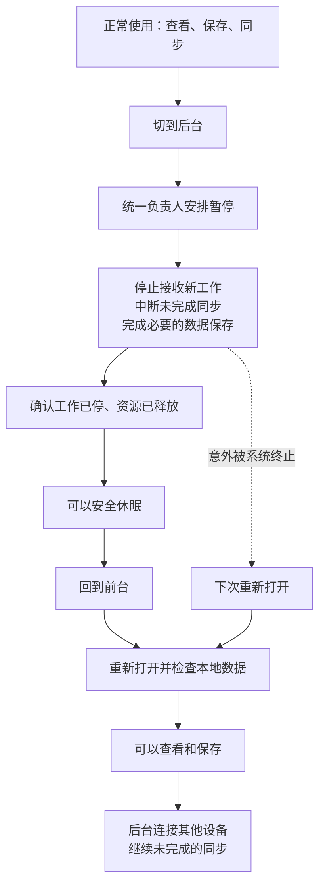
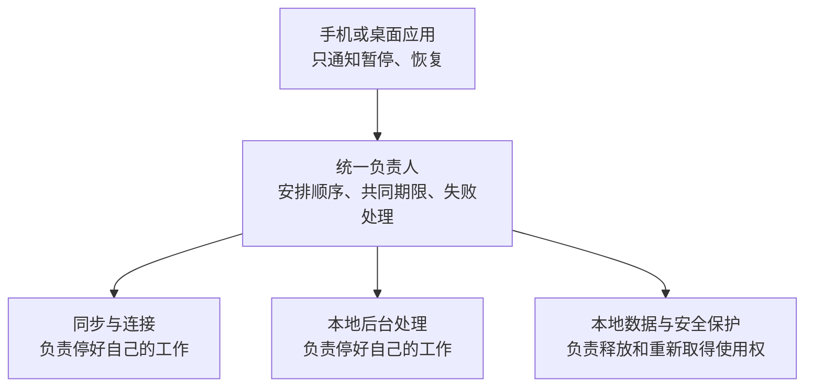

# 1. Overview

状态：实施中，统一负责人已接入三类现有能力及不可逆关闭意图，完成本地恢复故障拒绝及历史维护停止切片；全局门禁、共同期限、关闭错误完整汇总和持久同步恢复仍待完成。局部修复不代表本规格完成。

iOS 退后台时 Engine 曾报告暂停成功，但真实文件租约仍被持有。现有修复已覆盖一部分释放和任务退出问题，
但暂停责任仍分散，停止预算不统一，恢复耦合网络运行期，重启也不保证未完成同步再次执行。
用户确认统一暂停/恢复约定：后台优先安全停止、本地恢复不等待其他设备、意外退出后安全恢复未完成工作。
本规格是后续实现唯一入口；已有复现、局部修改及真机结果保留在
[后台暂停安全记录](2026-09-12-background-suspension.md)，不得将其测试结果计作本规格验收。

# 2. Goals

- 暂停成功后，所有受管工作已退出或进入不持有挂起敏感资源的休眠状态；旧任务不能再次写入或取得租约。
- 所有参与者采用同一暂停/恢复 port、同一转换负责人和同一绝对停止期限。
- 已确认保存的数据在暂停、进程终止和重新启动后仍可读取；未确认完成的保存允许完整提交或完整回滚。
- 恢复本地数据可用后开放本地操作；远端不可达不阻塞本地查看和保存，也不触发 LAN 降级。
- 未完成同步在恢复或重启后重新调度；主动取消、删除、撤权和内容失效不会被恢复覆盖。
- 重复通知、启动中退后台、快速切换、部分失败和调用方取消均由同一转换负责人处理。

# 3. Non-Goals

- 不建立通用插件注册系统、动态依赖图或通用任务持久化框架。
- 不要求所有文件传输支持字节级断点续传；允许重新传输并通过现有身份与去重规则安全收敛。
- 不重放已被取消的 Engine 调用，不恢复用户主动取消的业务意图。
- 不取消安全互斥、绕过加密、延长系统后台时间或通过主动崩溃实现停止。
- 不在本规格设计阶段修改产品仓、发布版本或更新产品依赖；产品接入属于最终联合验收的必要交付项。

# 4. Current Architecture Context

Component: Engine 生命周期入口
Path: `crates/uc-engine/src/engine/mod.rs`、`engine/in_flight.rs`
Responsibility: 稳定状态、操作入口、调用取消与事件。
Relationship: `EngineRuntime` 转交生产生命周期；当前入口串行，但取消登记和运行期收尾分处两层。

Component: 生产运行期
Path: `crates/uc-engine/src/runtime/session_supervisor.rs`、`runtime/dispatch.rs`
Responsibility: session 构造、自动重建、暂停和恢复。
Relationship: 当前依次停止 session、进程后台工作、安全状态；恢复反向准备，但 session 构造和本地恢复尚未解耦。

Component: Application 后台工作
Path: `crates/uc-application/src/application.rs`、`clipboard/assembly.rs`、`search/runtime.rs`、`space/membership/maintenance/runtime.rs`
Responsibility: 完整业务流程与各自工作生命周期。
Relationship: 不同所有者已有不同停止入口，不能仅枚举新加的 Clipboard 工作者就视为覆盖全部。

Component: 安全及磁盘能力
Path: `crates/uc-infra/src/security/profile_content_key_vault/`、`space/security/active_space_security_session/`、`clipboard/background_runtime.rs`
Responsibility: 读写许可、租约、缓存及实际后台磁盘动作。
Relationship: 必须等使用者退出才可释放共享资源；永久 close 不能代替可恢复 suspend。

Component: 文件传输恢复
Path: `crates/uc-application/src/transfer/file/lifecycle.rs`、`transfer/file/assembly.rs`、`clipboard/sync/`
Responsibility: 传输尝试、取消、启动清理和同步调度。
Relationship: 现有启动清理包含 `bulk_fail_inflight`；失败投影不等价于持久同步意图已获恢复。

Component: 移动绑定
Path: `bindings/uc-engine-uniffi/src/runtime.rs`
Responsibility: 宿主命令投递和结果等待。
Relationship: 当前 `receive_lifecycle_result` 等待有上限，超时不会取消已投递命令；不是安全挂起的完成证明。

# 5. Proposed Design

## 最终图景

以下两图表示实现目标，不表示当前代码已经完成。正常恢复先检查本地数据，不等待其他设备在线。





| 使用场景 | 目标表现 |
| --- | --- |
| 正在同步时退后台 | 中断当前尝试，回来后继续；已确认保存的内容不丢 |
| 回到前台，其他设备不在线 | 本地准备完成即可查看和保存，不等待远端连接 |
| 快速来回切换 | 按顺序完成转换，不重复启动工作 |
| 系统突然终止程序 | 下次打开检查并恢复仍然有效的未完成工作 |
| 用户已经取消同步 | 不因恢复或重启再次开始 |
| 本地数据暂时无法安全打开 | 明确报告未恢复，不开放依赖该数据的工作 |

新增后台功能必须接入同一管理并通过停止、恢复验证。图中暂停与恢复成功路径的失败处理、
期限耗尽及资源依赖约束见下文 Workflow，不能从简图推断所有转换总能成功。

## Components

完整负责人是 Application 内部新增的 `RuntimeLifecycleCoordinator`，它只处理运行生命周期，
不掌握成员协议、内容同步或密钥处理的业务步骤。Engine 保留稳定入口和组装职责，将目标状态与期限一次交给负责人，
根据最终结果发布状态；不得再维护第二份参与者顺序或失败回滚。

`RuntimeLifecyclePort` 与负责人放在 `crates/uc-application/src/runtime_lifecycle/`。
该层直接消费能力，因此 port 不放 Core，也不让 Infra 反向依赖 Engine。
Infra 的完整能力所有者实现 port；位于 Engine 的现有 session 装配通过 Engine 内部 adapter 接入同一 port。
原有门禁、任务登记等控制能力由组装注入，迁移时删除重复转换状态。

采用具名的必填参与者，不采用任意 `Vec` 加动态优先级：

| 参与者 | 完整责任 | 暂停前置条件 | 恢复前置条件 |
| --- | --- | --- | --- |
| 会话工作 | 网络收发、传输尝试、成员维护、自动连接及重建 | 全局入口关闭 | 本地资源准备完成 |
| 本地后台工作 | 内容物化、spool 清理、搜索与历史维护 | 全局入口关闭 | 本地资源准备完成 |
| 本地资源 | 存储使用权、安全缓存、数据库事务与相关持久访问 | 前两类及在途宿主调用全部停止 | 无 |

每项只负责它实际拥有的完整能力；嵌套工作由其唯一上级负责，禁止同一任务被多次注册。
以上为目标归属，实施前须逐项核对当前搜索、历史维护、传输超时任务及观测写入的实际所有者。
进程级观测不随普通暂停永久关闭；其文件访问也必须核实不会违反挂起条件。

## Data Model

- `LifecycleTarget`：本次目标 Active 或 Suspended；最终关闭保留独立终止语义。
- `TransitionContext`：转换代次与单调时钟绝对期限；队列等待、锁等待、停止和失败回收都消耗同一预算。
- 内部阶段：Active、Suspending、Suspended、Resuming、Incomplete、Stopped。
- `Incomplete`：资源安全尚未得到证明，入口继续关闭，不能对外映射成 Suspended；下一次请求先完成收尾。
- 每个参与者记录当前代次和已完成动作，使重试不会重复启动；这些短期状态不持久化。
- 业务恢复依据已有持久记录，不依据生命周期状态。缺失的同步意图字段由所属业务模块补齐并默认加密。

同步恢复需区分“持久意图”和“一次传输尝试”：后台停止结束尝试但保留意图，用户取消则使意图终止。
尝试失败可以更新展示状态，但不能抹去仍应同步的意图。恢复前重新检查内容存在性、成员权限与取消状态。
取消和恢复领取必须使用原有事务或版本比较保证互斥；没有原有能力时在业务所有者内增加最小持久支持。
不能仅凭内存队列承诺跨进程恢复，也不能把新业务负载明文加入通用生命周期日志。

## API / Interface

内部接口合同如下，具体 Rust 声明在实施时遵循现有异步 trait 和错误规范：

| 方法 | 输入 | 成功保证 | 失败保证 |
| --- | --- | --- | --- |
| `RuntimeLifecyclePort::suspend` | 共享 `TransitionContext` | 本参与者停止完成，不再持有其应交接资源 | 保留原始错误链，说明未完成，禁止伪造安全 |
| `RuntimeLifecyclePort::resume` | 共享 `TransitionContext` | 本参与者已本地就绪，后台网络重试已受管 | 不留下无人接管的部分启动任务，仍可调用 suspend 清理 |
| `RuntimeLifecycleCoordinator::transition` | 目标、共享期限 | 所有必要参与者到达目标 | 返回明确未完成结果并持有继续收尾责任 |

每个参与者的方法必须可重试；禁止默认空实现掩盖未接入的工作。无需生命周期能力的配置由明确的禁用 adapter 表达。
不增加 `is_safe` 轮询接口；成功结果本身即为证明，负责人不读取参与者内部阶段。

稳定 Engine 入口保留调用方一次暂停/恢复的形态，增加接收剩余预算的完整操作选项。
绑定在请求入队时转换为绝对期限；宿主不能传各内部步骤的预算，也不能读取内部参与者列表。
现有无参数调用可委托同一实现和默认策略，不能形成另一条生命周期路径。
跨语言返回需区分完成、未完成与命令未被接收；等待超时不能伪装成完成或普通业务失败。

## 代码示例

以下为结构示意，不是可直接编译的补丁。`TransitionContext`、`LifecycleError`、`pause_and_drain` 和
`ensure_workers_stopped` 是拟新增或调整的名称；具体定义须遵循上文合同及仓库错误处理规范。
示例省略了集中导入、统一入口门禁、在途宿主调用等待、转换代次、状态发布和执行任务所有权，实施时不能省略这些责任。

### 共同约定

```rust
#[async_trait]
pub trait RuntimeLifecyclePort: Send + Sync {
    async fn suspend(
        &self,
        context: &TransitionContext,
    ) -> Result<(), LifecycleError>;

    async fn resume(
        &self,
        context: &TransitionContext,
    ) -> Result<(), LifecycleError>;
}
```

`context` 包含本次转换的共同绝对期限，各参与者不能重新计时。`suspend` 成功必须代表实际停止完成，
不能只发送取消通知。`resume` 成功代表本参与者本地就绪，不代表其他设备已经连接。

### 完整工作负责人实现约定

```rust
#[async_trait]
impl RuntimeLifecyclePort for ClipboardBackgroundRuntime {
    async fn suspend(
        &self,
        context: &TransitionContext,
    ) -> Result<(), LifecycleError> {
        self.activity.pause_and_drain(context).await
    }

    async fn resume(
        &self,
        _context: &TransitionContext,
    ) -> Result<(), LifecycleError> {
        self.activity.resume().await;
        Ok(())
    }
}
```

`pause_and_drain` 在同一边界阻止新动作，并等待当前必要保存完成或回滚。总负责人不知道内部队列及任务列表。
示例的恢复仅适用于有界的本地开闸；如果实际恢复会等待锁、读盘或执行回收，也必须消费 `context` 的剩余预算，
不能因为示例使用 `_context` 就忽略期限。安全资源负责人实现相同 port，但负责租约交接及缓存重读。

### 总负责人管理顺序和结果

```rust
struct RuntimeLifecycleCoordinator {
    session_work: Arc<dyn RuntimeLifecyclePort>,
    local_work: Arc<dyn RuntimeLifecyclePort>,
    local_resources: Arc<dyn RuntimeLifecyclePort>,
}

impl RuntimeLifecycleCoordinator {
    async fn suspend(
        &self,
        context: &TransitionContext,
    ) -> Result<(), LifecycleError> {
        let (session, local) = tokio::join!(
            self.session_work.suspend(context),
            self.local_work.suspend(context),
        );

        // 等两边各自完成收尾后检查结果，保留所有失败的原始错误链。
        ensure_workers_stopped(session, local)?;

        // 使用者全部停止后，才能交接它们依赖的资源。
        self.local_resources.suspend(context).await
    }
}
```

此处并发只适用于已经确认相互独立的两组工作。不得改成首个错误就丢弃另一方 future 的处理方式。
`ensure_workers_stopped` 必须合并两边失败并保留 source chain，不能字符串化或只留下第一个错误。
示例执行前必须已经关闭入口；释放资源前还必须确认在途宿主调用退出。`join!` 本身不提供停止期限或阻塞调用中断能力。

### 恢复失败的收尾示例

假设本地资源恢复成功，而后台处理启动到一半失败：负责人先对失败的后台处理执行 `suspend`，
确认它新建的任务全部退出，再暂停本地资源。若会话工作也已经启动，同样先停止它。
回收沿用本次剩余预算，保留启动失败和回收失败的原因；回收未完成则保持 Incomplete，不能开放入口。

具体迁移时，从 `SessionSupervisor` 移出分散的生命周期顺序与回收安排，由统一负责人执行；
现有后台处理及安全资源接入 port。不要在旧安排外再包一层转发，也不要让 Engine 重复维护恢复回滚。

## Workflow

### 暂停

1. 负责人关闭新工作入口，撤销当前代次的重建及重试许可；正在启动的任务也必须登记在同一代次内。
2. 通知会话工作、本地后台工作和在途调用停止。通知应及时发出，不能先等待某个慢参与者才通知其他工作。
3. 等待各工作到达安全边界：短事务提交或回滚，取消后的任务真正退出；网络传输无需等待完成。
4. 独立参与者失败不阻止其他可安全进行的收尾；只要仍有资源使用者，不能继续释放其依赖资源。
5. 所有使用者退出后暂停本地资源，撤销缓存、结束事务并释放需交接租约。
6. 全部成功才发布 Suspended。超时或部分失败保留 Incomplete 和关闭入口，由同一负责人继续收尾或接受重试。

### 恢复

1. 若上次暂停尚未完成，先收尾，禁止新旧代次重叠运行。
2. 本地资源重新取得使用权并加载最新持久状态；加密数据无法安全打开则恢复失败。
3. 初始化本地能力，并启动受管的网络调度；本步骤不等待任何远端在线或握手完成。
4. 所有本地必要条件成立后开放入口并发布 Active。网络不可达沿既有恢复机制重试，认证/撤权失败按业务规则处理。
5. 本地必要步骤失败时，按依赖顺序暂停本次已启动及失败参与者；回收也使用剩余预算，未完成则进入 Incomplete。

### 快速切换、关闭和意外退出

转换执行由负责人持有，调用方丢弃等待不能丢弃收尾任务。连续通知只保留最新目标，已接受暂停仍先到达安全边界，
再按最新目标恢复；旧完成通知不得覆盖新代次。最终关闭阻止任何后续恢复。
重新启动不尝试复活旧异步调用；由传输、同步等业务所有者分别读取持久意图，进行幂等恢复。

### 时间耗尽的硬边界

共享期限是全流程停止要求，不是 `timeout` 包裹任意 future 就能兑现的保证。
每个磁盘临界区、阻塞调用和任务析构必须提供实测上界或可验证的取消方式；不可取消阻塞工作不能靠 `abort` 宣称停止。
负责人超时后继续收尾只保证责任不丢失，不能保证系统给它时间。宿主执行时间到期且尚未安全的路径是验收失败，
不得以返回错误、释放外层锁、结束 UIKit 后台活动或延长等待掩盖。
产品接入必须证明成功完成与结束后台活动的先后关系；无法证明的参与者必须修改其资源访问方式后才能宣告交付。

# 6. Implementation Plan

1. **资源与恢复清单**：核对 `runtime/`、Application 各工作者、Infra 持久访问及绑定，记录所有者、停止方式、最长临界区、
   重启依据和测试入口。风险：遗漏进程级任务；清单完整是下一步门禁。
2. **统一负责人和 port**：新增 Application 内部模块，Engine 组装三类必填参与者；移入顺序、代次、门禁与重试责任。
   先完成真实保存→暂停交接→恢复读取的最小闭环，保留已有通过的回归。风险：双重状态机或锁顺序死锁。
3. **本地恢复独立**：调整 `session_supervisor.rs` 的构造与恢复，将远端连接留给已有连接恢复负责人；
   本地必要恢复失败必须返回失败，不能仅 warning 后开放入口。风险：锁定状态、无 Space 初始状态与故障状态混淆。
4. **共同预算与绑定**：修改 Engine 完整操作选项及 UniFFI 命令封装，取消各层重新计时；覆盖等待方超时和取消。
   风险：仅缩短等待却遗留实际工作；必须以资源释放断言验收。
5. **持久同步恢复**：调整 `transfer/file/lifecycle.rs` 与所属同步流程，区分暂停尝试和主动取消，核对并补齐事务持久意图。
   风险：重复发送、撤权后重试、取消被覆盖和迁移兼容；以重启后的业务结果验收。
6. **联合验证和文档收口**：更新测试宿主及生成绑定，验证移动宿主剩余时间传入和后台活动完成逻辑；
   实际产品接入后执行真机矩阵。实现完成再更新稳定设计，移除旧的分散入口，归档本规格。

## 实施记录：资源与恢复清单

2026-09-12 开工检查以当前工作区为准，保留此前未提交的后台暂停修复。清单中的“未证明”是后续实施门禁，
不是已通过验收；现有取消通知、固定等待值和一次正常执行耗时均不构成磁盘临界区的最坏上界。

| 工作或资源 | 当前唯一所有者与代码入口 | 当前停止与恢复方式 | 临界区与缺口 | 实际验证入口 |
| --- | --- | --- | --- | --- |
| 宿主调用 | `crates/uc-engine/src/engine/in_flight.rs`、`engine/mod.rs` | 登记保留到调用退出，暂停取消并等待 | 外层取消不能证明底层阻塞写入退出；需统一入口和期限 | `in_flight::tests::cancellation_does_not_report_resources_released_until_the_operation_exits` |
| 会话调用及重建 | `crates/uc-engine/src/runtime/session_supervisor.rs` | 关闭操作门、停止旧会话、重建后开门 | 当前两段 2 秒等待各自计时；生命周期锁等待未计入；恢复存在只警告的失败分支 | 同文件操作门测试、`crates/uc-engine/tests/host_contract.rs` |
| 内容物化与 spool 清理 | `crates/uc-infra/src/clipboard/background_runtime.rs`、`background_activity.rs` | 进程 TaskRegistry 持有两项任务；共享读许可包围磁盘动作，写许可暂停 | 当前暂停无期限；完整动作中读写及扫描的最坏时长未证明 | `background_activity::tests`、`background_blob_worker` 的取消测试 |
| 搜索重建及修复 | `crates/uc-application/src/search/runtime.rs`、`coordinator.rs` | 会话 ApplicationRuntime 拥有，取消 scope 并等待 TaskTracker | `spawn_task` 通过 select 丢弃业务 future；`crates/uc-infra/src/search/sqlite_index.rs` 中已启动的 spawn_blocking 可能继续持有数据库连接；需在实际存储边界等待 | `search::coordinator::tests`；需新增真实阻塞存储退出测试 |
| 历史维护 | `crates/uc-application/src/clipboard/history/maintenance_runtime.rs` | 会话 ApplicationRuntime 拥有；等待当前完整动作结束，在后续动作开始前检查取消并 join | 启动先做文件核对；单个动作仍无共同期限；关闭保留原始 JoinError，Engine 汇总传播仍待迁移 | `maintenance_runtime_tests.rs` |
| 文件超时清理 | `crates/uc-application/src/application.rs` 的 FileTransferTimeoutRuntime | 会话拥有；通知后等待 1 秒，再 abort 并 join | abort 不保证 tokio::fs 的底层工作退出；逐项清理的最坏上界未证明 | `transfer/file/lifecycle.rs::tests::timeout_sweep_can_stop_before_receive_becomes_ready`；需磁盘动作验收 |
| 入站保存与自动发送 | `crates/uc-application/src/clipboard/assembly.rs`、`sync/sync_runtime.rs`、`inbound/runtime.rs` | ClipboardSession 拥有；顺序停止 recovery 与 inbound | 停止结果部分只记录警告；正在执行的恢复发送尚未消费共同期限 | `inbound/runtime.rs` 关闭测试、`sync/sync_runtime.rs` 恢复测试 |
| 活跃内容与恢复广播 | `crates/uc-application/src/clipboard/active/mod.rs` | ActiveClipboardSession 拥有 JoinSet 和监督任务 | 嵌套任务由此所有者接入，不能再向总负责人重复登记；发布及接收中的磁盘临界区待验证 | 同目录测试及 `sync/active_state/` 测试 |
| 成员维护及自动连接 | `crates/uc-application/src/space/membership/maintenance/runtime.rs`、`space/connectivity/` | SpaceFacade 拥有并随会话停止 | 维护当前轮次有独立 5 秒等待；关闭期限需要来自同一转换；不允许暂停后旧重建重开入口 | `membership/maintenance/tests.rs`、`connectivity/peer_connections/tests.rs` |
| 网络与文件传输 | `crates/uc-engine/src/assembly/sync_engine.rs`、`runtime/session_supervisor.rs` | ProductionSession 拥有 SyncEngineAssembly；应用工作退出后关闭网络 | 关闭结果与所有嵌套 provider/fetch 任务仍需逐项核验；停止尝试不能等同主动取消 | 网络关闭测试、传输真实接收测试，待补完整清单 |
| 本地安全资料与租约 | `crates/uc-infra/src/security/profile_content_key_vault/`、`space/security/active_space_security_session/` | 安全 adapter 暂停后清缓存、释放租约，恢复重新取用 | 必须先证明所有使用者退出；正常锁定、租约冲突与损坏需明确区分 | Vault tests、`host_contract::suspended_engine_releases_profile_lease_and_can_resume` |
| SQLite 连接及事务 | `crates/uc-infra/src/db/pool.rs`、`executor.rs` | DbPool 当前没有暂停门；执行者同步取得连接并运行闭包 | SQLite busy_timeout 为 5000 ms，但这不是完整事务上界；池等待、池维护线程、搜索阻塞任务均需核验 | `db/pool.rs` 真实数据库测试；需新增暂停后拒绝旧访问和事务退出证明 |
| 进程事件转发及剪贴板监听 | `crates/uc-engine/src/runtime/mod.rs`、`host_clipboard.rs` | 进程 TaskRegistry 拥有，普通暂停保留 | 纯转发可休眠；触发业务的路径必须走关闭后的统一入口；需检查迟到通知 | Engine 生命周期及宿主通知测试 |
| 诊断文件写入 | `crates/uc-observability-runtime/src/local_file.rs` | 进程 LocalFileRuntime 独立线程、有界队列、刷新与最终关闭 | 普通暂停没有可恢复停止入口；刷新后仍可接受新记录，不能用 flush 证明暂停后静默；文件写入上界待测 | `local_file.rs` 刷新/关闭测试；需暂停与恢复实测 |
| 绑定命令 | `bindings/uc-engine-uniffi/src/runtime.rs` | 独立命令线程，生命周期通道优先处理恢复期间的暂停 | 等待方 recv_timeout 不取消命令；需要入队时固定绝对期限并区分未接收与未完成 | 同文件生命周期等待与关闭期限测试 |

#### 阻塞访问与网络嵌套工作的补充核对

- `crates/uc-infra/src/blob/blob_writer.rs`、`blob/filesystem_store.rs`：文件摘要、硬链接及复制在阻塞线程执行，
  由内容保存/物化调用者拥有。大文件操作没有已证明上界；只取消等待者不能宣称文件访问停止。
- `crates/uc-infra/src/fs/atomic_publish.rs`、`fs/hidden_path.rs`：发布重命名、文件系统探测及隐藏属性同样进入阻塞线程，
  由入站接收/发布流程拥有。发布成功后如何在取消时完整结算需用真实文件检查。
- `crates/uc-infra/src/config_migration/adapter.rs`：归档、数据库快照、密封及发布归配置迁移完整调用所有，
  属于在途宿主调用，不能因不是循环工作而遗漏。`file_transfer/privacy_maintenance.rs` 的阻塞迁移归接收准备所有。
- `crates/uc-infra/src/mobile_sync/password_hasher.rs`：阻塞任务执行密码计算，需确认不持有挂起敏感资源，
  不能将所有阻塞任务等同磁盘写入者。以上连同搜索覆盖本次全目录搜索发现的 33 个实际 `spawn_blocking` 调用位置。
- `crates/uc-infra/src/network/iroh/node.rs::install_blobs` 创建 FsStore，并启用库内 GC；Router 的 BlobsProtocol
  负责 store 关闭。`IrohNode::shutdown` 先停止恢复 watchdog、关闭 endpoint 和连接观测，再等待 Router；
  当前 Router 超时或错误只警告并返回，不能作为磁盘安全证明。
- `crates/uc-infra/src/network/iroh/blobs.rs` 的 IrohBlobTransferAdapter 缓存 Downloader，库内部持有下载 JoinSet。
  `shutdown_inflight_fetch` 请求 `shutdown_endpoint`；该请求成功与全部下载/存储动作退出是否等价仍须核对锁定的库源码并实测。
  进度翻译由 `SyncEngineAssembly::outbound_progress_translator` 独立拥有，先停止后关闭 IrohNode。

### 持久恢复依据

- `clipboard/sync/sync_runtime.rs` 已有 EntryDeliveryRecord 恢复及当前成员检查，但不能据此宣称覆盖全部中断尝试。
  当前恢复选择还会替换更旧的离线内容，新增恢复必须保留这一业务规则。
- `transfer/file/lifecycle.rs` 启动执行接收 reconciliation，再执行 `bulk_fail_inflight` 清理遗留尝试。
  清理展示状态不提供发送意图；用户取消与暂停原因的持久互斥仍待逐条核对。
- 搜索用已持久化的 blocked 状态触发重建；spool 使用启动扫描恢复物化。两者都必须补充强制终止后的真实目录验证。
- Vault 恢复需重新读取持久资料；已确认内容的跨进程可读性和取消/删除/撤权后不重发尚未完成本规格验收。

### 当前验证

- 已运行 `cargo metadata --locked --format-version 1`，成功。
- 已运行 `cargo test -p uc-engine --test host_contract suspended_engine_releases_profile_lease_and_can_resume --locked -- --nocapture`，
  1 项通过。实际覆盖保存、暂停释放租约、另一持有者占用时恢复失败、释放后恢复读取与再次保存；测试运行 8.50 秒。
  这是本次重新执行的基准，不覆盖统一负责人、共同期限或重启同步恢复。
- 资源清单尚未完成：网络 provider/fetch 嵌套任务、数据库池维护线程及所有阻塞磁盘访问的上界仍需核验。
  因此阶段 1 和总验收均未勾选；不提前宣告进入统一替换完成状态。
- `cargo check --workspace --all-targets --locked`、`cargo fmt --all -- --check`、Rust 风格检查、仓库架构及隐私检查、
  `git diff --check` 均通过。整仓检查仅报告 HarmonyOS 测试中的现有未使用导入警告。
- 以上为 2026-09-12 盘点基准；当时未修改生产 Rust 实现。后续实施以下方按日记录为准。

### 2026-09-13：本地恢复失败不得开放入口

- 完整负责人暂仍是现有 SessionSupervisor；此次先落实其本地恢复成功条件，不新增另一套转换顺序。
  调用方仍只调用 Engine 的恢复入口；成功才开放操作，读取故障返回失败并由现有恢复路径交还安全租约，允许后续重试。
- `install_new_session` 不再把当前资料读取、损坏或就绪失败降为警告后开放入口。明确的 `KeyringMiss`
  继续作为正常锁定状态处理；需要完成 Space 切换时仍要求真正解锁。
- 已构造会话在检查待完成切换失败、本地恢复失败、切换后未解锁三条路径上，先执行完整会话关闭再返回错误。
  这避免失败分支直接丢弃仍有后台工作的会话；未声称解决关闭内部已有的错误只警告或阻塞任务上界问题。
- 真实宿主测试只对 `kek:v1:` 恢复读取注入失败，确保故障越过网络设置准备，命中原先警告后继续的分支。
  修改前测试在“本地资料不可读时不能报告恢复成功”断言失败；修改后 `host_contract` 全部 3 项通过。
  验证同时检查失败后维持暂停、拒绝保存、真实文件租约可交接，以及解除故障后的读取和再次保存。
- 同日 `runtime::session_supervisor::tests` 全部 7 项通过；重新运行 metadata、workspace 全目标检查、fmt、
  Rust 风格、仓库架构及隐私检查、diff 检查，均通过。仅有既存测试未使用导入/辅助函数警告。
- 阶段 3 的故障拒绝切片已实现；本地恢复与网络构造解耦尚未实现。阶段 2、4、5、6 尚未完成，
  资源清单中待验证的阻塞访问仍保留；真机、强制终止和产品接入矩阵跳过，总验收不勾选。

### 2026-09-13：历史维护在完整动作之间响应停止

- HistoryMaintenanceRuntime 继续独占历史维护任务；停止请求等待当前文件核对或清理动作结束，
  然后跳过尚未开始的缓存删除与保留策略删除，不通过丢弃磁盘操作 future 缩短等待。
- 启动尾部清理与周期维护使用同一取消检查；正常执行仍保持核对、缓存清理、保留策略的顺序，
  核对失败时仍跳过删除。下次运行沿现有维护触发重新检查，不持久化生命周期状态。
- 关闭失败保留原始 JoinError 并使用固定对外说明，不再字符串化任务失败。
- 定向 9 项测试通过，包括当前动作未完成时不能结束停止、核对后停止不启动缓存清理、
  缓存清理后停止不启动保留策略，以及 panic 的 source 与公开文本检查。
- 真实 `host_contract` 3 项回归通过；metadata、workspace 全目标、fmt、Rust 风格、架构及隐私、diff 检查均通过，
  仅保留 HarmonyOS 测试原有未使用导入警告。
- 本切片不提供磁盘动作最坏时长，不改变 ApplicationRuntime 与 Engine 的整体停止结果传播；
  统一负责人及全部参与者故障汇总仍未完成，不据此勾选整体暂停验收。

### 2026-09-13：统一负责人首个真实接入切片

- Application 的 `runtime_lifecycle/` 持有三类必填参与者与转换状态；Engine 只组装会话 adapter、
  ApplicationAssembly 本地后台能力及 Infra 安全资源能力，SessionSupervisor 的暂停/恢复入口提交目标。
  删除原有跨参与者顺序、恢复失败回收，以及 `suspend_process_runtime` / `resume_process_runtime`、
  `suspend_security_session` / `resume_security_session` 分散入口。
- 模块按职责拆分：入口只导出，参与者合同放 `ports.rs`，目标及共享上下文放 `model.rs`，
  失败集合放 `error.rs`，转换状态与执行任务由 `coordinator.rs` 独占。不让参与者依赖协调器或其他参与者。
  三类依赖通过具名必填字段组装，不依靠同类型参数位置区分责任。
- 会话可能等待本地物化，因此先停会话、再停本地工作，不未经证明就并发关闭两者。
  两项工作都成功停止后才交还资源；一项停止失败仍尝试另一项，所有原因保留在同一错误报告中。
  恢复先准备资源和本地工作，再安装会话；恢复失败调用同一暂停收尾，回收失败后下一次请求先重试清理。
- 转换执行任务持有负责人，等待方离开不会丢弃收尾；转换串行，重复目标不重复启动参与者。
  SessionSupervisor 的原子标记只作为旧网络重建许可保留，尚未迁移外层 Engine 宿主门禁与状态发布。
- 上下文包含代次和可选绝对期限，本切片生产无参数入口仍传 None；当前参与者尚未全部执行期限检查。
  不将上下文传递测试记为停止预算通过，不宣称保证平台剩余时间内完成。
- 最终关闭仍沿原生产关闭路径，连续目标合并、启动中退后台、全局门禁、进程诊断写入、
  下层停止错误的完整汇总及持久同步恢复仍未完成。阶段 2 仅记录真实接入切片，不勾选整体验收。
- 拆分后 6 项协调测试、8 项会话与错误映射测试、3 项真实宿主回归通过。真实测试覆盖保存、暂停交接、
  租约冲突、恢复读取故障、失败后禁止保存、解除故障后恢复读取及再次保存。
- metadata、workspace 全目标、fmt、Rust 风格、仓库架构及隐私、diff 检查通过；
  仅有既存测试未使用导入或辅助函数警告。设备与产品接入验证仍跳过。

### 2026-09-13：不可逆关闭与资源释放顺序

- 统一负责人接受关闭后永久拒绝恢复；关闭失败保留收尾重试能力，重复关闭不重复执行已完成工作。
  恢复中的每项能力启动前后检查关闭意图，已开始的动作完成后统一回收，不继续启动下一项。
  关闭等待方离开不取消已接受的收尾。
- Engine 最终关闭与资料重置接入同一关闭入口，先停会话和本地工作，再完成剩余任务关闭，
  最后永久关闭安全资源及清除构造能力。删除原先先关闭安全资源再停止工作的顺序。
- 关闭后的恢复错误映射为不可重试的无效状态；模块仍按合同、模型、错误和协调职责组织。
- 全局宿主门禁、共同期限、底层任务关闭报告及错误汇总尚未统一；本切片不能证明平台预算内安全结束。
  设备与产品验证跳过。
- 9 项协调测试、8 项会话回归、3 项真实宿主测试通过；真实场景从运行状态直接关闭，验证租约释放且不能恢复。
  metadata、workspace 全目标编译、fmt、Rust 风格、架构及隐私、diff 检查通过；仅有既存测试未使用内容警告。

### 2026-09-13：外层关闭结果与收尾重试

- 完整负责人：Engine 负责宿主可见的关闭结果，调用方继续只调用 `shutdown`；统一 Application 负责人仍负责参与者顺序。
- 关闭返回错误或超时后保持 `ShuttingDown`，保留事件流，拒绝恢复与普通操作；只有成功才发布 `Stopped` 并关闭事件流。
  同一入口允许从 `ShuttingDown` 重试收尾，不把不可恢复的业务错误改成可重试错误。
- 验证覆盖明确失败、阻塞超时、等待方取消后的重试，以及最终成功状态和事件流关闭。
- 本切片不改变外层 timeout 取消关闭 future 的现状，不宣称全部关闭任务独立执行；共同期限与底层错误汇总仍待完成。
- 21 项 Engine 相关测试与 3 项真实宿主测试通过；metadata、workspace 全目标编译、fmt、Rust 风格、
  仓库架构及隐私、diff 检查通过，仅有既存测试未使用内容警告。设备矩阵跳过。

### 2026-09-13：关闭等待与实际执行分离

- Engine 的 `shutdown.rs` 独占宿主关闭等待与最终结果发布；进入 `ShuttingDown` 后由任务持有运行期、
  状态、事件通道和关闭许可。调用方只等待结果，等待超时或丢弃 Engine 不取消已经开始的实际收尾。
- 同时或再次关闭必须先等待当前关闭许可，不重复启动；已成功关闭直接确认成功，实际失败后可以重试收尾。
  `lifecycle_gate` 只保护状态转换，关闭期间普通操作与恢复仍能及时得到拒绝。
- 在调用入口建立绝对期限，关闭及生命周期排队计入同一等待预算；再次等待不重置已启动任务的预算。
  无法表示的期限在任何状态修改前拒绝，避免时间加法 panic。
- 验证目标包含等待超时后继续执行、重复请求不重启、调用方和 Engine 都释放后仍结束事件流、排队耗时和极大期限。
- 限制：进入 `ShuttingDown` 前的操作排空仍随原调用执行；下层参与者共同期限及完整错误汇总未完成，
  不据此声称平台剩余时间内完成停止。设备验证跳过。
- 24 项 Engine 相关测试与 3 项真实宿主测试通过，覆盖零等待仍启动并完成收尾；metadata、workspace 全目标编译、
  fmt、Rust 风格、仓库架构及隐私、diff 检查通过，仅有既存测试未使用内容警告。

### 2026-09-13：关闭前操作排空由任务持有

- Engine 在获得关闭及生命周期许可后直接发布 `ShuttingDown` 并启动唯一关闭任务；操作排空、取消通知、
  实际退出等待及运行期关闭全部由该任务持有，不再由宿主等待 future 持有前半段。
- 宽限结束只通知取消并发布取消结果；操作登记未实际释放时，继续持有运行期，不调用其关闭入口。
  宿主等待可以超时，但不能据此发布 `Stopped`。普通 `quiesce` 行为保持原合同。
- 验证在操作排空中丢弃关闭等待方与 Engine，保持旧操作登记，检查取消通知后运行期仍未关闭；
  释放登记后确认唯一关闭与事件流结束。新操作和恢复在已接受关闭后立即拒绝。
- 排队阶段尚未接受的关闭请求仍由等待方持有；下层共同期限及错误完整汇总未完成，设备矩阵跳过。
- 25 项 Engine 相关测试及 3 项真实宿主测试通过；metadata、workspace 全目标编译、fmt、Rust 风格、
  仓库架构及隐私、diff 检查通过，仅有既存测试未使用内容警告。

### 2026-09-13：Application 关闭失败返回生产调用方

- FileTransferTimeoutRuntime 回归 transfer/file 领域目录；等待正常退出时保留任务错误，强制取消后等待实际析构并返回原始 JoinError。
- ApplicationShutdownReport 汇总历史维护、超时任务与搜索的全部类型化来源。生产会话关闭继续执行网络清理后才返回失败，
  SessionSupervisor 的暂停、重建、重置及 Space 切换消费该结果，不能在关闭失败后继续安装新会话。
- 本地恢复失败后的清理同时保留首因和清理失败，直到 Engine 稳定错误转换边界；不把原始失败替换成字符串。
- 尚未完成 TaskRegistry 和 Iroh 停止失败的完整汇总、共同期限及设备验证，不据此勾选整体关闭验收。
- 18 项 Application 关闭测试、8 项会话测试、3 项真实宿主测试通过；metadata、workspace 全目标、
  Engine lan-compat 全目标、fmt、Rust 风格、架构与隐私、diff 检查通过，仅有既存测试未使用内容警告。

### 2026-09-13：后台任务报告与资料重置停止边界

- TaskRegistry 在保持原有停止和析构顺序的基础上保留全部 JoinError；报告的 Debug/Display 不暴露 panic 负载。
  标准 source 指向首个失败，其余失败可在同一报告内追溯。
- 会话关闭、最终关闭、资料重置均检查报告。任务已经实际退出时继续永久资源收尾，最终返回失败；
  任务取消超时经过嵌套报告仍保持 DeadlineExceeded 分类。
- StopProfileRuntimePort 与统一生命周期共享错误合同，资料重置保留停止 source，不在停止失败后启动密钥或数据删除；
  解除停止故障后可由同一入口重试。未修改资料重置其他失败类型及持久化阶段语义。
- Iroh 下层完整报告、统一期限和设备验收仍未完成。
- 显式启用 task-registry 的 4 项任务测试、6 项资料重置测试、9 项会话测试和 3 项真实宿主测试通过；
  metadata、workspace 全目标、fmt、Rust 风格、架构与隐私、diff 检查通过，仅有既存测试未使用内容警告。

### 2026-09-13：Iroh 慢收尾不丢弃协议资源

- 当前锁定的 Iroh Router.shutdown 首次调用会取走任务句柄，后续调用看到取消标记会直接成功；
  因此不能在 watchdog 到期后丢弃原 future 或重新调用关闭。
- 节点在 watchdog 后继续等待同一关闭 future，保留节点许可直至协议处理器实际结束；
  watchdog 只记录固定慢收尾诊断，不作为安全完成依据。实现归 node/shutdown，调用入口保持不变。
- 验证使用真实 Router 和故意阻塞关闭的协议处理器，检查超过 watchdog 后资源仍被持有且节点未报告关闭；
  放行处理器后检查资源释放。Iroh 结构化失败返回及共同期限仍待完成，设备矩阵跳过。
- 新增真实慢收尾测试、32 项既有节点测试和 3 项真实宿主测试通过；受保护中继测试因缺少对应环境按原设置跳过。
  metadata、workspace 全目标、fmt、Rust 风格、架构与隐私、diff 检查通过，仅有既存测试未使用内容警告。

### 2026-09-13：UniFFI 关闭重试与入队期限

- MobileEngine 在关闭开始后拒绝普通请求，但保留生命周期通道到成功；失败或等待超时可以再次关闭，
  Worker 在失败后继续服务生命周期命令，普通请求通道结束不会提前退出该循环。
- Shutdown 命令在入队前固定绝对期限，处理时只传剩余预算；等待超时明确映射 DeadlineExceeded。
  事件流确认实际停止后允许确认迟到成功，不通过轮询内部参与者推测安全。
- 线程回收由 WorkerJoin 持有唯一 join 与最终结果；超时后继续回收，重复等待不会把空句柄视为成功，
  已完成失败不被后续等待掩盖。调用方销毁时仍交接到回收线程；启动观察者离开后保留 Engine 停止等待。
- 生命周期中断会话恢复后不再二次读取已结束的恢复任务；关闭实现、线程回收与大命令分派分开组织。
- 验证关闭失败后重试、排队耗时、迟到完成、重复 join、真实绑定零预算关闭后再次关闭及重开同一资料。
  真实移动设备和完整平台停止时限尚未验证。
- 27 项绑定内部测试与全部 24 项真实绑定合同测试通过；metadata、workspace 全目标、fmt、Rust 风格、
  架构与隐私、diff 检查通过，仅有既存测试未使用内容警告。未执行 iOS/Android 真机验收。

### 2026-09-13：关闭参与者共用绝对期限

- 生产关闭在开始时固定期限，经过网络恢复停止、统一负责人、会话操作排空、会话任务、Application 文件超时任务及最终任务回收时不重置；资料重置同样共用一次期限。
- TaskRegistry 在获取任务锁前计算期限；到期后仍取消并等待实际析构。会话操作未释放时报告超时并保持入口关闭，允许再次关闭确认。
- 不带期限的既有内部恢复使用会话默认宽限；历史维护、存储和 Router 的必要收尾继续等待实际完成，不把期限传递等同于设备挂起时间已经达标。
- 完成标准：可控时钟验证锁排队、连续任务组和文件超时工作不获得新预算，真实 Engine 关闭及暂停恢复回归通过；重试仍由既有关闭负责人执行。
- 验证：Core 任务管理 6 项、Application 关闭 18 项及文件超时 3 项、会话管理 10 项、真实宿主 3 项通过；metadata、workspace 全目标、fmt、Rust 风格、架构与隐私、diff 检查通过。设备矩阵仍未执行。

### 2026-09-13：暂停与恢复不依赖等待方存活

- Engine 接受暂停、恢复及 quiesce 后，独立任务持有排队、执行与状态发布；调用方停止等待或释放 Engine 不丢弃已接受转换。
- 入口状态、排空和结果发布归 engine/lifecycle，Application 保持参与者通知与回收顺序；不在入口增加第二套参与者编排。
- 重复暂停、恢复确认现有状态，不重复执行底层动作；quiesce 队列耗时计入原等待期限。
- 完成标准：阻塞暂停/恢复后取消等待者，验证实际完成、最终事件、操作许可及不重复执行；排队时取消并销毁 Engine，仍完成资源回收。最新目标合并与启动中通知尚未完成。
- 验证：28 项 Engine 相关测试、补充后的 4 项等待取消与排队测试、3 项真实宿主及移动绑定暂停恢复测试通过；metadata、workspace 全目标、fmt、Rust 风格、架构与隐私、diff 检查通过。真机矩阵未执行。

### 2026-09-13：网络关闭失败完整返回

- Iroh 节点拥有网络恢复观察、连接观察和 Router 的全部关闭结果；异常不跳过剩余清理，摘要仅输出固定说明和数量。
- 故障注入发现先关闭 endpoint 会使 Router 提前结束并丢失其原始失败；现在先轮询 Router 关闭取得唯一 join，再并行关闭 endpoint 与观察者。若 Router 在接管前已自行结束，当前库无法再提供原始 join，明确返回提前结束错误，不伪报正常关闭。
- 连接观察保留提前回收的任务失败，首次异常后拒绝新增观察任务，避免长期积累无限失败记录；到期取消也等待析构并返回原始错误。
- 网络组装以进度工作实际 join 作为完成依据，移除重复确认通道；进度失败后仍关闭节点，再把完整结果交回会话负责人。Application 启动失败同时保留网络回收错误。
- 完成标准：真实 Router 与恢复任务同时故障后，原始失败均保留、资源释放且节点可以重开；观察任务提前失败和强制停止、进度任务失败均有测试。共同期限和最坏收尾时长尚未覆盖整个网络实现。
- 验证：节点 35 项通过、受保护中继 1 项按环境跳过；观察工作 2 项、进度工作 3 项、生产节点连续重开十次及真实宿主 3 项通过。metadata、workspace 全目标、fmt、Rust 风格、架构与隐私、diff 检查通过；未执行真机矩阵。

### 2026-09-13：高频进度通知下的有界收尾

- 进度工作归独立模块，网络组装不再承载节流与终态循环。收到关闭后固定当时接收位置，新通知不能延长本次排空；积压丢帧消耗对应旧位置，仍处理缓冲中的已完成终态。
- 关闭命令优先处理，最终确认仍等待实际任务退出；未新增截止时间配置或吞掉工作异常。
- 完成标准：宿主回调持续补入通知时只处理停止前进度；缓冲落后时保留最终完成状态，其余在途进度结束为取消；现有网络关闭与宿主回归通过。
- 验证：5 项进度测试与 3 项真实宿主测试通过；metadata、workspace 全目标、fmt、Rust 风格、架构与隐私、diff 检查通过。设备矩阵未执行。

### 2026-09-13：宿主暂停剩余时间入口

- Engine 的 suspend_with_deadline 与 UniFFI/HarmonyOS 同名完整动作入口接收剩余时间，入队前固定期限，排队、调用排空和统一参与者消耗同一次预算。UniFFI 原入口复用既有十秒默认值。
- 等待结束后已接受暂停继续执行；超时返回 DeadlineExceeded，不能作为安全暂停证明，可再次暂停确认最终结果。不可表示的 Engine 期限在接受请求前拒绝。
- 完成标准：可控时钟验证排队超时后的期限不重置、慢参与者继续收尾、非法预算不改变状态；真实绑定零预算后再次暂停并恢复正常工作。HarmonyOS 设备运行和 iOS/Android 系统后台验收仍未执行。
- 完整绑定回归发现资料重置错误地把最终任务组的 500 ms 宽限扩大为整个重置期限，前置清理消耗后迫使正常后台任务取消。资料重置没有宿主预算，恢复其无期限转换与最终任务组原有宽限；有宿主期限的暂停、关闭仍传递原绝对期限。新增直接生产重置测试保留完整错误来源并验证删除前确已停止。
- 验证：7 项暂停/排队边界、28 项绑定内部测试、全部 25 项真实绑定合同以及直接生产资料重置通过；metadata、workspace 全目标、Engine dev-tools+lan-compat 全目标、fmt、Rust 风格、架构与隐私、diff 检查通过。未执行设备系统后台矩阵。

### 2026-09-13：网络内部等待消费共同期限

- 会话把原期限传到网络组装与 Iroh 节点；连接观察不再无条件重新获得 500 ms，Router 诊断期限也不晚于宿主期限。
- 即使剩余时间为零，Router 仍持有原关闭 future 到协议资源实际退出；无宿主期限的工具调用使用现有默认等待值，不添加新的产品配置。
- 完成标准：可控时钟验证观察任务不重置过期期限，真实协议处理器验证零预算仍等待资源释放，正常节点与实际暂停恢复回归通过。磁盘阻塞动作的最坏上界仍未证明。
- 验证：节点 36 项通过、受保护中继 1 项跳过，观察工作 3 项、移动绑定零预算暂停恢复与退出空间通过；metadata、workspace 全目标、fmt、Rust 风格、架构与隐私、diff 检查通过。

### 2026-09-13：搜索停止保留实际磁盘工作

- 搜索负责人持有启动检查、重建、修复和清理直到实际完成；取消只在完整动作边界生效，不丢弃仍等待阻塞线程的 future。启动检查的调用方离开也不丢失该工作。
- 私有 task_scope 只负责登记、关闭与重新开放；暂停尚有旧工作时拒绝重开，永久关闭后不能恢复。重建决策与存储流程仍在协调器，模块入口只声明模块。
- 完成标准：真实阻塞线程未退出时暂停与关闭不完成；退出后可以恢复，永久关闭拒绝新工作。整次索引写入仍等待完成，不据此声称最坏耗时符合移动系统期限；搜索后台 panic 汇总和通用磁盘访问范围继续追踪。
- 验证：41 项搜索相关测试与 3 项真实宿主合同通过；metadata、workspace 全目标、fmt、Rust 风格、架构与隐私、diff 检查通过。启动等待取消与旧工作未结束时拒绝恢复均有直接覆盖。

### 2026-09-13：搜索异常收尾保留失败

- 搜索任务负责人保存后台任务的原始 JoinError；首次异常拒绝新增工作并通知已有工作停止，等待所有已登记工作退出后返回完整失败，重复暂停或最终关闭不清除失败。
- 启动检查等待包含失败登记，避免工作异常刚发生时返回成功；空间搜索活动保留原始错误链，不再把下层失败转成字符串。失败后的同一搜索运行期不重新开放，重建运行期由已有会话恢复负责人负责。
- 修复任务被关闭入口拒绝时撤销重复登记并释放并发名额，防止下次正常恢复后的查询无法重新安排修复。
- 完成标准：多个任务异常完整保留、其他工作仍完整收尾；暂停、恢复和最终关闭均能看见失败，公开摘要不输出异常负载；正常搜索和空间活动回归通过。
- 验证：45 项搜索相关测试、3 项空间活动测试与 3 项真实宿主合同通过；metadata、workspace 全目标、fmt、Rust 风格、架构与隐私、diff 检查通过。

### 2026-09-13：关闭请求从排队起由执行方持有

- Engine 接受有效关闭请求时即关闭操作准入；关闭许可与生命周期排队均放入持有运行期的执行任务，排队超时或等待方离开不撤回关闭。
- 排队仍消费原期限，开始实际收尾时只传递剩余预算；重复请求仍串行确认或重试，不与正在执行的关闭重复清理。
- 已开始的恢复结束后再次检查关闭意图，不发布 Running，不重新开放操作。参与者清理顺序仍由 Application 负责人决定。
- 完成标准：排队等待取消并释放 Engine 后仍实际停止；排队超时无需再次请求也完成关闭；恢复与关闭竞争时无迟到 Running，已有失败重试与零预算测试继续通过。
- 验证：37 项 Engine 相关测试及全部 25 项真实移动绑定合同通过；metadata、workspace 全目标、fmt、Rust 风格、架构与隐私、diff 检查通过。

### 2026-09-13：文件超时清理等待实际磁盘动作

- 文件超时工作接收停止后在记录之间退出；通知发送方已离开同样停止，取消优先于到期计时，不再把已关闭通知通道当成继续扫描的信号。
- 共同期限到达时仅记录固定运行诊断，仍等待原任务完成，不 abort 正在等待磁盘线程的任务。原始任务异常仍返回 Application 关闭汇总。
- 完成标准：实际阻塞线程尚持有资源时不能返回停止成功；过期期限不丢弃当前动作，工作通知通道关闭后即使接收已就绪也不启动扫描。单条清理动作的最坏耗时继续按设备验收追踪。
- 验证：7 项文件生命周期测试、19 项 Application 关闭相关测试及 3 项真实宿主合同通过；metadata、workspace 全目标、fmt、Rust 风格、架构与隐私、diff 检查通过。

### 2026-09-13：宿主操作取消保留实际执行所有权

- Engine 的普通与开发工具操作统一由 engine/operation 接受、持有登记许可并发布一次终态；等待方离开通知取消，执行方仍等待完整动作结束。尚未开始的已取消工作不调用运行期。
- 生产会话取消不再丢弃 operation future，而是通知动作取消并继续等待其安全边界；当前 ResetSpace 的自停例外保持。暂停与关闭排空看到的是实际工作结束，不是等待方消失。
- 取消通知与终态发布分开登记，调用方先取消后再关闭仍只发布一次取消结果；任务 panic 转换为稳定失败并回收登记，不暴露异常负载。
- 完成标准：真实阻塞线程在调用方取消并销毁 Engine 后仍被持有，关闭只在线程退出后完成；取消终态恰好一次，异常任务释放登记，正常业务与移动绑定合同通过。各动作内部嵌套阻塞调用仍需按资源清单继续核对。
- 验证：40 项 Engine 相关测试和全部 25 项真实移动绑定合同通过；metadata、workspace 全目标、fmt、Rust 风格、架构与隐私、diff 检查通过。

### 2026-09-13：剪贴板接收与自动恢复关闭保留失败

- ClipboardSyncRuntime 在私有 shutdown 模块中持有完整收尾：同时通知接收和离线恢复停止，等待正在执行的自动发送结束，再缓存完整结果。等待方取消不丢弃执行任务，重复确认保留同一份来源。
- 接收任务的 JoinError 不再字符串化，离线恢复 join 结果不再忽略；两类失败都进入 ApplicationShutdownReport。运行期停止后自动发送明确跳过，离线恢复所有者意外释放也通知任务退出。
- 自动发送复用既有 ClipboardOutboundPort，生产仍委托同一 ClipboardOutboundFacade 完整动作；未增加步骤接口。通用生命周期错误的默认 Debug 仅显示失败数量，原始错误链继续显式保留。
- 完成标准：同时发生两类任务异常且等待方离开时仍等待在途发送，重复确认不会变成成功；停止后不调用发送能力，异常来源完整且默认输出不泄露负载，正常接收与暂停恢复通过。ActiveClipboard 工作者及其余资源的完整失败汇总继续追踪。
- 验证：7 项自动同步、12 项接收、14 项出站、9 项统一生命周期测试，3 项真实宿主合同与移动绑定自动发送通过；metadata、workspace 全目标、fmt、Rust 风格、架构与隐私、diff 检查通过。

### 2026-09-13：当前剪贴板工作协作停止并汇总失败

- ActiveClipboard 的工作装配、恢复来源接入和收尾移到私有 lifecycle 文件；模块入口不再承载任务组关闭逻辑。接收、历史置顶、上线重发与恢复广播共用停止通知，在完整动作边界退出，不再 abort 工作组。
- 生命周期被释放或关闭等待被取消时仅通知停止，原监督任务继续持有工作组；延迟恢复来源在停止后不再构造新工作。恢复工厂本身也在受管任务内运行，工厂 panic 不会使监督者丢弃其他磁盘工作。
- 工作组保留所有原始 JoinError，继续等其余工作实际退出；结果进入 ApplicationShutdownReport，启动失败回收也保留 ActiveClipboard 清理错误。
- 完成标准：真实阻塞线程、同时多项异常、等待方取消和所有者释放均不提前结束收尾；暂停通知优先于等待中的广播，已排队恢复来源不再启动；正常当前剪贴板、恢复与绑定合同通过。单次拉取或持久动作的最坏时长仍未完成设备证明。
- 验证：6 项当前剪贴板、44 项同步状态与 25 项移动绑定合同通过；metadata、workspace 全目标、fmt、Rust 风格、架构与隐私、diff 检查通过。OHOS 合同保留已有未使用导入警告。

### 2026-09-13：离线补发在安全边界响应停止

- 补发依赖、工作所有者与扫描移到私有 recovery 模块，测试独立存放；同步入口只保留捕获发送和整体装配，未增加公开步骤接口。
- 同一停止通知覆盖启动扫描、上线事件、发送许可排队与历史读取。排队可直接退出；已开始的读取完整等待，停止后不再读取下一项或发起发送。
- 已开始的旧内容失效属于完整持久动作，完成后再响应停止，防止重启后旧记录仍可补发；已开始的发送及其失败落库也完整收尾。任务失败仍由既有同步关闭负责人汇总。
- 完成标准：真实阻塞读取未结束前不宣称停止，读取结束后不补发；旧内容清理一旦开始就完整完成；等待发送许可时不依赖其他发送结束才能退出。单次旧内容扫描的最长时间与异常终止恢复继续追踪。
- 验证：9 项离线补发与同步关闭测试通过；metadata、workspace 全目标、fmt、Rust 风格、架构与隐私、diff 检查通过。

### 2026-09-13：成员维护停止不再遗留当前轮次

- 成员维护运行期独占停止通知，移除内部五秒超时和监督任务 abort。显式关闭、所有者释放、关闭等待取消及命令通道关闭都保留当前完整维护轮次，由原监督任务等其结束后退出。
- 停止优先于新的成员、在线与周期触发；网络先暂停，当前维护动作继续到完整边界，不把宿主等待期限当作工作已结束。
- 完成标准：越过旧五秒期限仍等待当前工作；释放等待方和所有者后，不接收新工作且当前动作完整结束。成员任务原始失败汇总、单轮最长边界和真实设备期限继续追踪。
- 验证：10 项成员维护测试与真实暂停租约交接、恢复合同通过；metadata、workspace 全目标、fmt、Rust 风格、架构与隐私、diff 检查通过。

### 2026-09-13：成员维护失败进入完整关闭结果

- 成员维护保存首次原始 JoinError，当前轮次异常后不再重启工作；暂停、恢复、状态触发和关闭均保留同一失败来源，不再字符串化或吞掉任务异常。
- Space 私有关闭模块完整持有连接与成员清理，等待方离开不丢弃动作；即使连接关闭失败也继续停止成员维护，缓存汇总结果供重复确认。Application 关闭报告及三条启动回收路径继续携带 Space 失败。
- 默认成员与活动错误摘要隐藏来源正文，显式 source chain 仍完整。完成标准：异常后不能恢复工作、原始来源经过暂停与关闭保持一致、其他清理继续执行，正常 Space 与手机绑定合同通过。
- 验证：231 项 Space、25 项移动绑定合同通过；补充连续通知中的异常确认后，11 项成员维护测试再次通过。metadata、workspace 全目标、fmt、Rust 风格、架构与隐私、diff 检查通过。

# 7. Edge Cases


| Scenario | Expected behavior | Implementation |
| --- | --- | --- |
| 空库、未创建 Space、正常锁定 | 本地基础功能可用，不伪造已解锁 | 本地恢复保留明确正常状态，区别于损坏错误 |
| 重复通知与并发保存 | 一次转换，入口关闭后不接受新保存 | 代次与统一门禁，提交边界测试 |
| 启动中退后台 | 新建任务不能逃离暂停管理 | 任务启动前登记，构造失败也完整回收 |
| 无网络或远端不在线 | 本地可读可写，网络稍后重试 | 连接等待不在本地恢复关键路径 |
| 数据损坏、租约被占用 | 不开放依赖该资源的工作，可重试且保留原因 | 本地恢复错误向上传递并回收已启动工作 |
| 系统期限为零或极大值 | 零立即走停止通知，极大值不溢出 | 绝对期限安全转换；零预算不虚报完成 |
| 写入或传输途中进程终止 | 数据无半成品成功状态，未完成意图可重试 | 事务边界、重启恢复、身份去重 |
| 用户取消与恢复竞争 | 取消一旦确认，不能被旧恢复提交覆盖 | 事务或版本检查，不重放取消调用 |
| 升级旧数据库 | 不将历史用户取消误判为可恢复同步 | 以旧状态语义迁移；无法判别记录不得自动重发 |
| 等待者离开或绑定等待超时 | 收尾仍由负责人持有，不能报告安全 | 请求与执行生命周期分离 |

# 8. Testing Strategy

## Unit Test

- 输入可控制阻塞、失败与析构的参与者，执行暂停/恢复，断言通知顺序、资源依赖顺序、失败继续清理和反向回收。
- 使用可控时钟消耗入队、锁等待和停止时间，断言剩余预算递减且不重置；零预算及溢出输入有确定结果。
- 连续输入暂停、恢复、暂停并丢弃等待方，断言无重复启动、无旧代次重开入口、最终目标正确。

## Integration Test

- 真实 Engine 保存后暂停，由另一合法实例取得租约并更新状态；恢复必须读取新状态，不能沿用缓存。
- 所有磁盘写入者在暂停成功后保持静默；测试主动触发旧通知、计时器和网络回调，断言无新写入和重新取锁。
- 网络完全不可达时恢复并执行本地保存与查询，断言不等待连接完成。
- 独立子进程在事务前后、内容物化及传输过程中强制终止，重新打开同一加密目录，断言已确认内容存在、无半提交成功、
  未完成同步最终收敛且不重复生成业务记录。另测取消、删除、撤权后重启不恢复该意图。
- 真实绑定模拟等待超时、宿主离开与系统剩余时间到期，以实际任务退出和锁释放决定结果，不以回调返回决定结果。

## Regression Test

- 保留既有锁交接、Vault 缓存撤销、TaskRegistry 析构和后台队列暂停测试；新增端到端覆盖而非只核对方法调用次数。
- 串行执行相关 Engine/Application/Infra/Core 与 UniFFI 测试，之后运行仓库全目标检查、格式与架构门禁。
- iOS 本次问题系统和受支持稳定系统：真实后台、锁屏、等待挂起、重新打开、快速切换、启动中切换、读写及传输中切换。
- Android 与桌面验证暂停恢复及重启恢复，不把 iOS 后台时间策略机械套用到其他宿主。

# 9. Acceptance Criteria

* [ ] 资源清单覆盖所有工作者、持久访问及嵌套任务；每项有唯一所有者与实际验证入口。
* [ ] 所有参与者实现统一约定，旧分散生命周期顺序已删除，Engine 未暴露内部步骤。
* [ ] 暂停成功后锁可交接、事务已结束、无旧任务延迟写入或重开资源。
* [ ] 队列和清理共享期限；每个参与者的取消及最坏临界区有证据，超时不虚报安全。
* [ ] 重复通知、快速切换、启动中暂停、失败重试及等待方取消均通过。
* [ ] 无网络时本地恢复、读取和保存通过；必要本地资源故障不误报恢复成功。
* [ ] 已确认保存的数据在强制终止后完整可读；未完成同步可重试，取消、删除和撤权不被复活。
* [ ] 绑定及实际移动宿主完成结果一致，不存在宿主误以为安全而结束等待的路径。
* [ ] 两类 iOS 系统及其他宿主矩阵完成；未执行项标为跳过，不宣告全项交付。
* [ ] 格式、依赖、workspace、架构和隐私检查通过；稳定文档与实际实现一致。

# 10. Risks and Trade-offs

统一 port 的价值是统一可证明的结果，不是消除资源依赖。固定参与者避免通用注册框架的维护成本，
但新增完整职责必须显式修改组装和验收清单。必要的短事务等待比直接取消慢，却保护已经确认的保存。
允许重新传输而非承诺字节续传简化恢复，但增加网络成本；最终结果必须幂等。
返回未完成结果是诚实的故障状态，不能替代平台安全保证；这是完整交付最重要的剩余风险。

# 11. Open Questions

以下是实施前需要用代码清单、实测和平台接入回答的问题，不再重复询问已确认的产品取舍：

- 所有持久写入者、阻塞调用及进程观测文件的最坏占用时间是什么？现有取消方式能否覆盖？
- 每类未完成同步是否已有足够持久依据？旧版本记录能否可靠区分用户取消与进程中断？不能区分时如何迁移？
- 当前受支持稳定 iOS 设备是否可用？实际宿主能提供多少剩余时间，哪些路径会提前结束后台活动？
- 默认预算与收尾预留值须由上述测量确定；本规格不虚构固定秒数，也不把系统给定时间视为恒定承诺。
